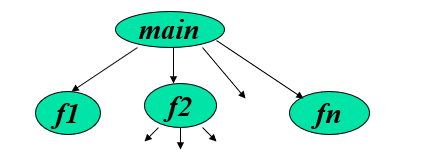
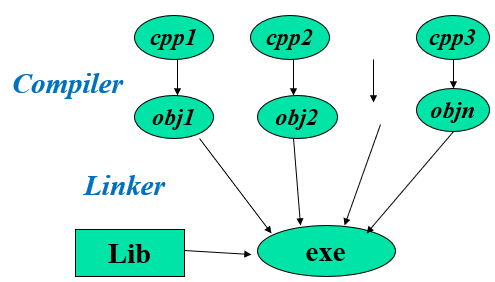
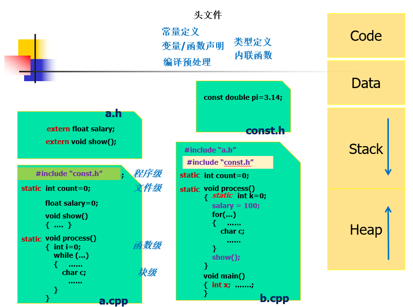

Cpp(编译**预**处理)
---

<!-- TOC -->

- [1. 编译预处理](#1-编译预处理)
- [2. #include](#2-include)
- [3. #define](#3-define)
  - [3.1. 符号常量](#31-符号常量)
  - [3.2. 开放子过程](#32-开放子过程)
  - [3.3. 过程函数泛型](#33-过程函数泛型)
  - [3.4. Generic `types`](#34-generic-types)
  - [3.5. 重命名vaou](#35-重命名vaou)
  - [3.6. 字符串连接](#36-字符串连接)
  - [3.7. 特殊目的用法](#37-特殊目的用法)
  - [3.8. General macro processing](#38-general-macro-processing)
- [4. #ifdef](#4-ifdef)
- [5. #pragma](#5-pragma)
- [6. 程序组织](#6-程序组织)
  - [6.1. 头文件和cpp文件](#61-头文件和cpp文件)
  - [6.2. extern的另一个用法](#62-extern的另一个用法)
  - [6.3. 头文件的内容](#63-头文件的内容)

<!-- /TOC -->

# 1. 编译预处理
1. 与作用域、类型、接口等概念格格不入
    1. 潜伏于坏境:编译预处理，可以不写在程序中
    2. 穿透作用域:在编译预处理的时候，忽略作用域。

```c++
//编译预处理潜伏于环境
#include <stdio.h>
extern double sqrt(double);
void main()
{
   printf("The square root of 2 is %g\n",sqrt(2));
   fflush(stdout);//立刻输出
   return(0);
}
//cc -Dsqrt=rand -Dreturn=abort(-D是开关变量,Define,是find&replace)
//上一句的含义是将sqrt转换成为rand，然后将return替换成about
//返回值
//The square root of 2 is 7.82997e+28
//abort - core dumped(将内存中所有的状态保存下来)
```
2. 设想:
    1. 置换
    2. 应用方式丰富,很难为其的找到具有更好的结构且高效的替代品
3. 关于对于#include、#define、#ifdef、#pragma的不同处理

# 2. #include
1. include会打开文件内容，然后将文件内容拷贝过来
2. 保证接口的定义在本文件中有效
3. 暴露源文本

# 3. #define

## 3.1. 符号常量
1. `#define pi 3.14`
2. `const pi = 3.14`
3. 不需要分号，因为他是编译预处理而不是代码

## 3.2. 开放子过程
使用inline函数

## 3.3. 过程函数泛型
1. `#define max(a,b) (a) > (b) ? (a) : (b)`这个max宏和函数有什么区别
    + 为什么没有括号不行?因为他不懂乘法:`#define mul(a,b) a * b`
    + 如果使用:`max(1+2,2+3)//1 + 2 * 2 + 3`
    + 宏还可能带来重复计算(只是一个编译预处理)
2. double int等对函数重载
3. 宏是定义和所有的同类型比较的泛型。
4. 宏的严重缺陷，宏没有函数的类型检查
5. 将int写成参数T(类型参数):`T max(T,T)`

## 3.4. Generic `types`
1. 使用模板来替代大量重复的部分

## 3.5. 重命名vaou
1. namespace的形式

## 3.6. 字符串连接
1. 不可以被替代
```c++
#define Conn(x,y) x ## y //x 和 y连接起来
//在编译之前进行替换
#define ToChar(x) #@x
#define ToString(x) #x
```
2. 这个是为了帮助框架的实现

## 3.7. 特殊目的用法
1. 不可以被替代
2. 特殊语法:
```c++
#if //如果

#else //不然

#elif //不然如果

#endif //if结束

#ifdef //如果定义了

#ifndef //如果没有定义
```
3. 例子:
```c++
#ifndef MY_PRINTF_VERSION //如果宏在之前没有被定义
　 #define MY_PRINTF_VERSION 1 //那么将这个宏定义为1

#endif
//选择编译，选择不同情况下，使用哪个源代码
#if MY_PRINTF_VERSION == 1
    void printf(*str) {}
#elif MY_PRINTF_VERSION == 2
    int printf(char* fmt, char* args, ...){}
#endif
```
4. 有些程序的部分是保障机制，在不同形式下的保障是不同的
5. 使用开关量的编译选择，用来在发布的时候对于不应该被发布的东西进行开关量的调整。(就可以不用删除)
6. 有一些调试是不能通过断点调试的，所以我们就可以打开开关变量，用来记录更加清晰深刻的日志。

## 3.8. General macro processing
1. 不可以被替代
2. 我们可以将一些warning确认没有问题忽略掉
3. 我们也可以通过将一些warning提高为error的高级别，这样子就可以更加清晰的发现问题(IDE集成)
```c++
once
warning(disable:4101)
warning(error:160)
```

# 4. #ifdef
1. 版本控制
2. 注释代码

# 5. #pragma
1. 层间控制
2. 告知编译器
3. `#pragma pack()`
    + 在计算机内存空间中，我们往往是要进行数据的对齐，这样子可以提高内存数据的读取效率
    + 我们可以通过传递预编译指令用来对于指定数据的对齐
4. <a href = "https://www.cnblogs.com/flyinggod/p/8343478.html">#pragma pack()用法详解</a>

# 6. 程序组织
1. 逻辑结构：相关联的函数/文件形成的抽象上的图结构
2. 物理结构：考虑到每个函数f存储的位置，不一定存在同一个cpp
3. 一个源程序不论有多少个源文件，只有一个源文件能包含main函数



1. 工程文件
    1. 外部函数
    2. 外部变量
2. 组织是物理层面



5. 我们直接将一些头文件`.h`中写好函数原型

## 6.1. 头文件和cpp文件



1. 我们要始终注意scope和lifetime
2. 作用域
   1. 程序级作用域(函数外定义的变量):一个程序可能有很多源文件，程序级就是说整个程序可见
   2. 函数级作用域:在Stack中，同一个函数内可见
   3. 块级作用域:在Stack中，同一个代码块内可见，比如while循环中定义的一个变量
   4. 文件级作用域:在A和B中的process()是不同函数的，同一个文件中可见
3. 协同:B中使用A中的，需要标明extern，然后在编译前确认查找
```c++
extern float salary;
extern void show();
```
4. 将外部要用的，开发的，A把对应的放到a.h头文件中，而B就不需要进行读取A文件内容，B在使用时在文件头`#include "a.h"`:功能就是直接复制粘贴过来，是preprocess命令
5. 如果有些服务不想要提供:将作用域限制到文件内:就是文件级作用域
6. 常量作用域默认是文件作用域，我们也将其抽象成为`const.h`文件来查看管理
7. main是全生命周期的，活在栈中。

## 6.2. extern的另一个用法
1. extern可以用来修饰变量或函数，用来说明此变量/函数是在别处定义的，要在此处**引用**，而不会新开辟一块内存。
   - 该变量或函数必须是唯一的，如果多个cpp文件中都有定义则会报错
   - 一般不用extern修饰常量，因为常量默认作用域是文件
2. 函数默认的生命是extern的，带有关键字仅仅是语义上这个函数可能在其他源文件里有定义。

## 6.3. 头文件的内容
1. 放置不占空间的部分
2. 放置常量定义
3. 放置变量/函数声明(为什么可以这么干？)
   1. **a.cpp和a.h并没有联系**，link时会从所有编译好的文件中找B需要的符号，如果几个不同文件中实现了同一个函数/定义了同一个全局变量，就会报错
   2. 编译阶段，B虽然找不到该函数或变量（理解为符号表的信息不完整)，但连接时会从A生成的目标代码中找到此函数
4. 放置宏
5. 放置类型定义
6. 放置内联函数(必须写到头文件)
    + 为什么内联函数要放置到头文件中?因为不这么做，无法正常使用
    + inline是基于源代码的复用，根据原型是不行的
    + 如果头文件中有inline，但是被拒绝了？如果头文件中的inline函数很复杂(loop等)，那么我们会将对应代码替换进去的时候，生成了多份的static(局部于文件作用域)
    + 相对的话:如果不是inline函数，那么函数只会有一份。

```c++
//c.h
inline int f(){
    return 1;
}
//c.app
#include "c.h"//是可以inline的
```
7. 头文件可以再次放置头文件