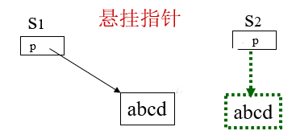

C++ 类的封装
---

<!-- TOC -->

- [1. 类](#1-类)
- [2. 类的构造函数](#2-类的构造函数)
- [3. 成员初始化表(构造函数中变量初始化的一种方法)](#3-成员初始化表构造函数中变量初始化的一种方法)
- [4. 类的析构函数](#4-类的析构函数)
  - [4.1. C++资源回收机制](#41-c资源回收机制)
  - [4.2. 析构函数例子](#42-析构函数例子)
- [5. 类的拷贝构造函数](#5-类的拷贝构造函数)
  - [5.1. 拷贝函数的使用情况以及定义](#51-拷贝函数的使用情况以及定义)
  - [5.2. 拷贝构造函数的深拷贝](#52-拷贝构造函数的深拷贝)
  - [5.3. 拷贝构造函数的初始化问题](#53-拷贝构造函数的初始化问题)
  - [5.4. 拷贝构造函数的部分问题](#54-拷贝构造函数的部分问题)
  - [5.5. 参考](#55-参考)
- [6. 类的移动构造函数](#6-类的移动构造函数)

<!-- /TOC -->

# 1. 类
1. 两种成员：
    1. 数据
    2. 操作(函数)
2. 将实现和类定义分离
    1. 头文件主要是声明
    2. 源文件:存储实现
3. 在链接的时候，将其他文件中的部分连接过来。

```C++
//a.h 存储类的头文件
class TDate{
    public:
        //只有函数签名
        void SetData(int y,int m ,int d);
        int IsLeapYear();
    private:
        int year,month,day;
}
//a.cpp 用来存储相应的实现部分
//TDate::命名空间
void TDate::SetDate(int y ,int m ,int d){
    year = y;
    month = m;
    day = d;
}
int TDate::IsLeapYear(){
    return (year%4 == 0 && year % 100 !=0)||(year % 400 == 0);
}
```
1. 如果直接将函数定义直接放在头文件里，会建议compiler将其作为inline函数进行编译。
2. 如果函数长度很长的话，反复调用的函数调用时间就会占比很小，而相反的话则会很大。
3. 随便使用内联函数可能是的代码很烂:get和set函数我们选择使用inline方式
4. 代码长度不超过10行，不包含for、switch等语句。

```c++
//a.h 不分开实现和签名
class TDate{
    public:
        void SetData(int y,int m ,int d){
            year = y;
            month = m;
            day = d;
        }
        int IsLeapYear(){
            return (year%4 == 0 && year % 100 !=0)||(year % 400 == 0);
        }
    private:
        int year,month,day;
}

TDate g;//声明全局对象，这个对象已经调用了构造函数，完成了分配
int main(){
    g.SetDate(2000,1,1); 
    TDate t;
    t.SetDate(2015,11,17); 
    TDate *p = new Tdate;
    p->SetDate(2015,11,17);//简介访问
}
```

# 2. 类的构造函数
1. **对象的初始化**(完成对象内存分配)
    1. 为创建的对象建立标识符
    2. 为对象数据成员开辟内存空间
    3. 按照规定对成员变量进行初始化
2. 描述
    1. 与类同名，无返回类型(不是void)
    2. 自动调用，不可直接调用
    3. 可重载
    4. 默认构造函数:无参数
        + 当类中未提供构造函数时，编译系统提供默认构造函数。
        + 为什么要有？对于类的成员变量，默认值初始化
        + 如果你写一个带参数，那么你必须要自己配一个没有参数的默认构造函数。
    5. public:可定义为private:接管对象创建
    6. private的构造函数:单例模式，类内部的构造方法控制(可以控制类的个数)
3. 调用:
    1. 自动按照参数列表来对应构造函数
    2. 具体调用方式参照底下。

```c++
class A{
    public:
        A();
        A(int i);
        A(char *p);
}
A a1 = A(1);
A a1(1);
A a1 = 1;
//以上都是调A(int i)
A a2 = A();
A a2;
//以上都是调A()，注意：不能写成：A a2();
A a3 = A("abcd");
A a3("abcd");
A a3 = "abcd";
//以上都是调A(char *)
A a[4];//调用a[0]、a[1]、a[2]、a[3]的A()
A b[5]={ A(), A(1), A("abcd"), 2, "xyz"};
```

# 3. 成员初始化表(构造函数中变量初始化的一种方法)
1. 构造函数的补充
   1. 构造函数:先开辟空间并赋默认值
   2. 成员初始化表:开辟空间的时候就赋值
2. 执行:(常量和引用的声明和定义要放在一起，只能通过这个方法来完成)
    1. **先于构造函数执行**
    2. **按类数据成员声明次序**:下面的例子中先 x 再 y 再 z
3. `static const`:常量数字，这个是可以在类内部进行初始化(`static const a = 1;`)
```c++
class A{
    //非静态成员可以初始化
    int x;
    const int y;
	int& z;//引用
	public:
        //签名的冒号后面，用变量(值)来进行初始化，这就是初始化表
	    A(): y(1),z(x),x(0){
            x = 100;//赋值
        }
};
```
4. 减轻Compiler负担:
    + 正常构造函数中赋值`x = 100`：首先对象构造的时候进行了赋值，之后再次进行了赋值，共计2次
    + 成员初始化表的时候，只进行了赋值一次。
5. 初始化顺序问题:先执行p，再执行size有问题，按照字面序进行。

```c++
class CString{
    char *p; 
    int size;
public:
   CString(int x):size(x),p(new char[size]){}    
};
```
1. **在构造函数中尽量使用成员初始化表取代赋值动作**
    1. const 成员 / reference 成员 / 对象成员:为什么？，默认构造函数？
    2. 效率高:见上面
    3. 数据成员太多的时，不采用本条准则,降低可维护性
    4. C++ 11之后允许在构造函数外进行初始化:避免在每个函数的成员初始化表中进行初始化。

```c++
class A {
	int m;
public:
	A() {
        m = 0; cout << "A()" << endl;
    }
	A(int m1) {
        m = m1;
        cout << "A(int m1)" << endl;
    }
};
class B {
	int x;
	A a;//每一次创建类都优先创建
    public:
        B(){
            x = 0; cout << "B()" << endl;
        }
        B(int x1){
            x = x1;
            cout << "B(int x1)" << endl;
        }
        B(int x1, int m1):a(m1){
            x = x1;
            cout << "B(int x1, int m1)" << endl;
        }
        //不能在函数体里写A的构造函数（已经调过了)
};
int main() {
	B b1;// 调用 B::B() 和 A::A()
	cout << "_______________" << endl;
	B b2(1);   // 调用 B::B(int) 和 A::A()
	cout << "_______________" << endl;
	B b3(1, 2); // 调用 B::B(int,int) 和 A::A(int) … 
}
//result:
//A()
//B()
//_______________
//A()
//B(int x1)
//_______________
//A(int m1)
//B(int x1, int m1)
```

# 4. 类的析构函数
1. 格式:`~<类名>()`
2. 功能:RAII:Resource Acquisition Is Initialization(资源获取即初始化)
3. 调用情况
    1. 对象消亡时，系统自动调用
    2. C++离开作用域的时候回收
    3. 使用delete关键字的时候进行调用

## 4.1. C++资源回收机制
1. Java的垃圾回收机制：finalize():调用后在下一次垃圾回收的时候才会进行回收
    1. 效率不好，会卡。有些不支持。
    2. GC的效率存在障碍，存在不能使用GC的场合
    3. GC只能回收Java存放在堆上的资源
2. C++的垃圾回收机制：谁创造谁释放，主动权在程序员手里。稳定效率，表现好。
3. Private的析构函数：(强制自主控制对象存储分配)
    1. 回收对象的过程被接管，保证对象在堆上进行创建，但是不能使用delete，那么我们可以在内容提供一个destroy()方法来进行回收
    2. 写在栈或者全局区是不能通过编译的（自动调用，发现调不到)
    3. 强制在堆上进行创建，对很大的对象而言有好处强制管理存储分配
    4. 适用于内存栈比较小的嵌入式系统

```c++
class A{
    public:
        A();
        void destroy(){delete this;}
    private:
        ~A();
};
//析构函数私有，无法声明
A a;
int main(){
    A aa;//析构函数私有，无法声明
};
A *p = new A;//在堆上声明
delete p;//错误
p->destroy();//可能出现p的null空指针问题
```
1. 更好的解决方案声明成静态方法：free

```c++
//Better Solution
static void free(A *p){ delete p; }
A::free(p);
```

5. 栈上的内存资源会自动释放，所以我们只针对堆上的资源的释放

## 4.2. 析构函数例子
```c++
class String{
    char *str;
public:
   	String(){
        str = NULL;
    }
   	String(char *p){
        //str这个数组是不会单独释放出去的
        str = new char[strlen(p)+1];  
        strcpy(str,p);
    }

   	~String(){
        //额外资源要释放掉
        delete []str;
        //str和对象同声明周期
    }
	int length(){return strlen(str);}
	char get_char(int i){return str[i];}
    void set_char(int i, char value){str[i] = value;}
	char &char_at(int i) {  return str[i]; }
	char *get_str(){return str; }
	char *strcpy(char *p){
        delete []str;
        str = new char[strlen(p)+1];
	    strcpy(str,p);
        return str;
	}
	String &strcpy(String &s){
        delete []str;
        str = newchar[strlen(s.str)+1];
        strcpy(str,s.str);
    }
	char *strcat(char *p);
	String &strcat(String &s);
};
```

# 5. 类的拷贝构造函数
1. 相同类型的类对象是通过拷贝构造函数来完成整个复制过程：自动调用：创建对象时，用一同类的对象对其初始化的时候进行调用。
2. 默认拷贝构造函数
   1. 逐个成员初始化(member-wise initialization)
   2. 对于对象成员，该定义是递归的
3. 什么时候需要拷贝构造函数:
   1. 赋值拷贝构造
   2. 传参进行拷贝
   3. 返回值进行拷贝
4. 拷贝构造函数私有:目的是让编译器不能调用拷贝构造函数，防止对象按值传递，只能引用传递(对象比较大)

## 5.1. 拷贝函数的使用情况以及定义
```c++
//赋值拷贝构造
A a;
A b=a;
//传参进行拷贝
f(A a){}
A b;
f(b);
//返回值进行拷贝
A f(){
    A a;
    return a;
}
f();
//拷贝构造函数
public:
    //const避免出现修改
    A(const A& a);//一定要写引用，不然就递归调用了
```

1. 为什么对象是一个引用类型:不然会出现**循环拷贝**问题:如果没有引用的话，传参则会拷贝，那么就会出现循环拷贝
2. 按照这个格式背过。

## 5.2. 拷贝构造函数的深拷贝
```c++
class string {
    char *p ;
    public :
        string(char *str) {
            p = new char[strlen(str)+ 1 ];
            strcpy(p, str);
        }
        ~string() {delete[] p;}
};
string s1("abcd");
string s2 = s1;//悬挂指针
//deep copy
string::string(const string& s) {
    p = new char[strlen(s.p)+1];
    strcpy(p,s.p);
} 
```


1. 原来S1和S2两个指针都指向"abcd",但是随着S1的归还，S2就变成了一个空指针了。
2. 此时我们通过深拷贝完成拷贝
3. 没有深拷贝需求的时候，使用编译器默认构造函数即可

## 5.3. 拷贝构造函数的初始化问题
1. 包含成员对象的类
    1. 默认拷贝构造函数:调用**成员对象**的**拷贝构造函数**
    2. 自定义拷贝构造函数:调用成员对象的**默认构造函数**：程序员如果接管这件事情，则编译器不再负责任何默认参数。
2. 拷贝函数的拷贝过程没有处理静态数据成员
3. 默认拷贝构造函数:
    1. 逐个成员初始化
    2. 对于对象成员，该定义是递归的

```c++
class A { 
	int x, y;
	public:
		A() { x = y = 0; }
		void inc() { x++; y++; }
};
class B {
	int z;
	A a;//已经默认创建了
	public:
		B(){ z = 0; }
		B(const B& b):{ z = b.z; }
		void inc() { z++; a.inc(); }//拷贝构造函数
		void inc() { z++; a.inc(); }//指定调用a的拷贝构造函数
};
int main() {
	B b1;    //b1.z = b1.a.x = b1.a.y =0 
	b1.inc();//b1.a.x = b1.a.y = b1.z=1 
	B b2(b1);//b2.z=1 b2.a.x=0 b2.a.y=0,这个时候调用的是A的默认构造函数
}
```

1. 如果想要调用A的拷贝构造函数的话:`B(const B& b):a(b.a){z = b.z;}`
2. 移动构造函数:将存储单元从一个对象移动到另一个对象`move constructor A(A&&)`,例子如下

```c++
string generate() {
    return string("test");
}
string S = generate();
//上面先进行了创建test
//然后进行了拷贝返回
//然后再拷贝给S(拷贝赋值)
```

3. 移动构造:`move constructor A(A&&)`：将已经创建好的部分移动给对应部分，避免进行重复拷贝。

## 5.4. 拷贝构造函数的部分问题
1. 拷贝构造函数必须是引用传递，不能是值传递? 防止递归调用
2. 如何识别拷贝构造函数?构造函数的第一个参数是(X&|const X&|volatile X&|const volatile X&)

## 5.5. 参考
<a href = "https://blog.csdn.net/sinat_39370511/article/details/91981033">详见</a>

# 6. 类的移动构造函数
```c++
string generate(){
    return string("test");//反复进行拷贝，右值
}
string S = generate();
int x=5;

int & y=x;
const int & z=5;

//移动构造函数 move constructor
A(A &&)

string::string (String &&s):p(s.p)//两个&&，如果是右值，则进行移动，并且将原来的资源置为NULL，左值不会调用
{s.p=nullptr;}
```

1. 左值:左侧变量，右值是常数、表达式或者函数。
2. Const只能被绑定到右值上
   1. 不可以写成`int &x = 5`
   2. 为什么不可以对非const引用绑定一个右值？可能会导致可以修改临时变量的值，不允许被修改。
3. 移动构造函数:直接将对应的右值移动过来(我们已经将vector和String进行了是此岸)
4. &&是右值引用，不会被左值调用。
5. 五删原则:拷贝构造、拷贝赋值、析构函数、移动构造、移动复制
   1. 提供上面的5个函数之一，则需要自己提供默认函数
6. 书面考试不做要求