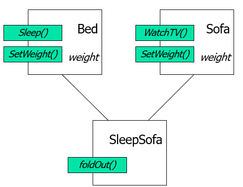
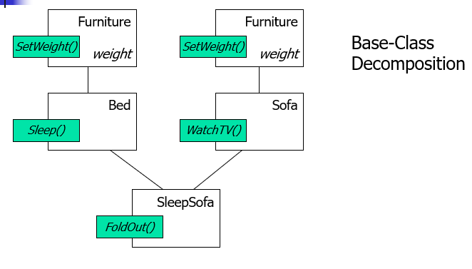
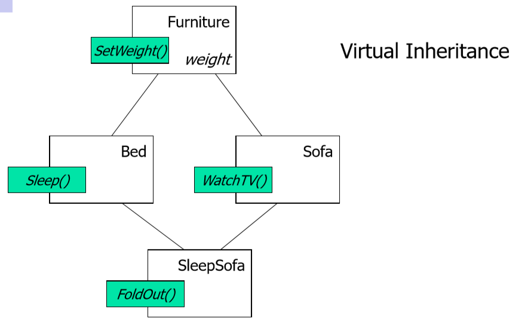
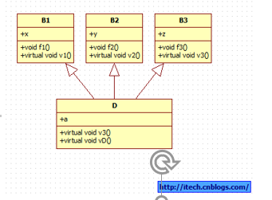
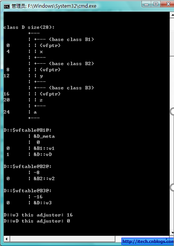
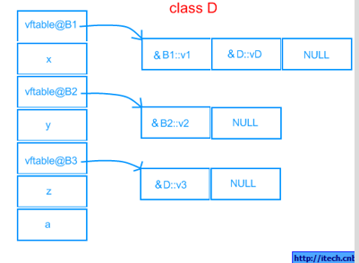

继承
---

<!-- TOC -->

- [1. 继承机制](#1-继承机制)
- [2. 单继承](#2-单继承)
  - [2.1. 核心代码示例](#21-核心代码示例)
  - [2.2. 继承方式](#22-继承方式)
    - [2.2.1. public](#221-public)
    - [2.2.2. private](#222-private)
    - [2.2.3. protected](#223-protected)
  - [2.3. 继承声明方式](#23-继承声明方式)
  - [2.4. 基类和继承类的方法关系](#24-基类和继承类的方法关系)
    - [2.4.1. 派生类中的showInfo()](#241-派生类中的showinfo)
    - [2.4.2. 基类的showInfo()](#242-基类的showinfo)
    - [2.4.3. 方法调用的顺序](#243-方法调用的顺序)
  - [2.5. 方法覆盖](#25-方法覆盖)
  - [2.6. 不可以被继承的部分](#26-不可以被继承的部分)
  - [2.7. 访问权限的修改方法](#27-访问权限的修改方法)
- [3. 继承的初始化](#3-继承的初始化)
- [4. 多继承](#4-多继承)
  - [4.1. 定义](#41-定义)
  - [4.2. 基类声明顺序(初始化顺序)](#42-基类声明顺序初始化顺序)
    - [4.2.1. 名冲突](#421-名冲突)
    - [4.2.2. 虚基类](#422-虚基类)
    - [4.2.3. 虚基类注意](#423-虚基类注意)
    - [4.2.4. 多继承理解](#424-多继承理解)

<!-- /TOC -->

# 1. 继承机制
1. 基于目标代码的复用
2. 对事物进行分类
   1. 派生类是基类的具体化
   2. 把事务（概念)以层次结构表示出来，有利于描述和解决问题
3. 增量开发(面向接口编程)

# 2. 单继承
1. protected:
   1. 如果没有继承的话，protected和private是相同的
   2. 派生类可以访问基类中protected的属性的成员。
   3. 派生类不可以访问**基类中的对象**的protected的属性。
   4. **派生类含有基类的所有成员变量**

## 2.1. 核心代码示例
```c++
class Student {
    int id;//id在Undergraduated_Student中仍然是私有的
    public:
        char nickname[16];
        void set_ID (int x) {id = x;} 
        void SetNickName (char *s) {strcpy (nickname,s);}
        void showInfo () {cout << nickname << ":" << id << endl ;}
        void showInfo(int x){cout << x << endl;}
};
class Undergraduated_Student: public Student {
    int dept_no;//学院编号
    public:
        void setDeptNo(int x){dept_no = x;}
        void showInfo(){cout << dept_no << ":" << nickname << endl;}
        void set_ID (int x) {……}
        void showInfo(){
            cout << dept_no << ":" << nickname << endl;
        }
    private:
        Student::nickname;//这样在才能修改可见性
        void SetNickName();//新定义了一个private方法，父类对应方法被隐藏
};
Undergraduated_Student us;
us.showInfo(10);//可以吗？不可以,因为是新的名空间，重定义后面的名空间访问不到
```

## 2.2. 继承方式
1. public、private:访问权限只和基类中的访问权限有关

### 2.2.1. public
1. public:`class Undergraduated_Student: public Student`
2. 原来的public是public，原来的private是private
3. 如果没有特殊需要建议使用public

### 2.2.2. private
1. private:原来所有的都是private，但是这个private是对于Undergraduate_Student大对象而言，所以他自己还是可以访问的。
2. 默认的继承方式

### 2.2.3. protected
1. 如果没有继承的话，protected和private是相同的
2. 派生类可以访问基类中protected的属性的成员。
3. 派生类不可以访问**基类中的对象**的protected的属性。
4. **派生类含有基类的所有成员变量**

## 2.3. 继承声明方式
```c++
//错误声明
class Undergraduated_Student : public Student;//声明的时候是不用声明继承的
//正确声明
class Undergraduated_Student;
```

## 2.4. 基类和继承类的方法关系

### 2.4.1. 派生类中的showInfo()
1. 派生类中的showInfo():Overwirtten **重写(绝对不是覆盖)**，隐藏基类的showInfo()函数
2. 而并不是覆盖操作

### 2.4.2. 基类的showInfo()
1. 如果基类中有一个`void ShowInfo(int x)`:那么是不是从基类可以进行调用呢？
   1. 不可以(所有函数都被隐藏)
   2. 因为重定义将名空间进行了覆盖
2. 父类中的所有的函数都不可见:但是我们可以通过指定名空间来完成访问:`using Student::showInfo`,所有的版本都可以见，这时候是重写。

### 2.4.3. 方法调用的顺序
1. 首先在名空间中按照名称进行匹配
2. 一旦名称匹配，则会校验函数参数
3. 匹配不上是不会去别的名空间进行匹配(也就是不会去student那里去匹配)

## 2.5. 方法覆盖
1. 我们需要指明覆盖:`virtual`:在对应想要重写的函数的前面写上一个virtual
2. 虚函数实现的是多态

## 2.6. 不可以被继承的部分
1. 构造函数和析构函数是不可以被继承的:是对类进行初始化的，无法继承
2. 运算符重载函数也是不可以被继承的

## 2.7. 访问权限的修改方法
```c++
private:
    Student::nickname;//char nickname[16];语法上没问题，没有将原来的nickname变为私有的
    void SetNickName();//新定义了一个private方法，父类对应方法被隐藏
```

1. 声明`char nickname[16];`并没有修改可变性，语法无误，语义不对；

# 3. 继承的初始化
1. 派生类对象的初始化
    + 由基类和派生类共同完成
2. 构造函数的执行次序
    1. 基类的构造函数
    2. 派生类对象成员类的构造函数(注意！)
    3. 派生类的构造函数
3. 析构函数的执行次序(与构造函数执行顺序相反)
    1. 派生类的析构函数
    2. 派生类对象成员类的析构函数
    3. 基类的析构函数
4. 基类构造函数的调用
    + 缺省执行基类默认构造函数
    + 如果要执行基类的**非默认构造函数**，则必须在派生类构造函数的成员初始化表中指出

```c++
//测试执行和析构顺序
class A{
    int x;
    public:
        A() {x = 0; }
        A(int i) { x = i; }
};
class B: public A
{   int y;
    public:
        B(){y = 0;}
        B(int i) {y = i;}
        B(int i, int j):A(i){
            //成员初始化表中显式调用基类构造函数
            y = j;
        }
        B(const B& b){//拷贝构造
            //首先调用A的默认初始化构造函数
            //如果想要调用对应拷贝构造函数，必须用成员初始化表声明
            //拷贝构造函数
        }
};
B b1;//执行A::A()和B::B()
B b2(1);//执行A::A()和B::B(int)
B b3(0,1);//执行A::A(int)和B::B(int,int)
class B: public A{
    public:
        //继承下来多版本的构造函数
        using A::A; //继承A的构造函数
}
```

# 4. 多继承

## 4.1. 定义
1. 定义
```
class <派生类名>：[<继承方式>] <基类名1>，
                 [<继承方式>] <基类名2>，…
{〈成员表〉}
```
1. Java不允许多继承，是因为多继承非常复杂。
2. 继承方式:默认是private的继承方式：public、private 、protected
3. 继承方式及访问控制的规定同单继承:重复进行继承
4. 派生类拥有所有基类的所有成员



- 可以睡的沙发:继承sofa和Bed
- setWeight重名:两个基类有相同部分，我们会拆分基类



- 之后我们拆分出来setWeigth()(Base Class Decomposition)



- 形成菱形结构:还有问题，Weigth变量依旧在，已然有两个Weigth部分
- 解决方案:虚继承

## 4.2. 基类声明顺序(初始化顺序)


1. 基类的声明次序决定：
    1. 对基类构造函数/析构函数的调用次序(顶部基类，同层基类按照声明顺序) 上图中就是 ABCD的顺序
    2. 对基类数据成员的存储安排
2. 析构函数正好相反

### 4.2.1. 名冲突


1. <基类名>::<基类成员名>
2. 成交变量和成员函数的重名问题:在上图中，D中会有B和C的x
3. 问题:每次setWeight到底是设置谁的？

### 4.2.2. 虚基类
1. 如果直接基类有公共的基类，则该公共基类中的成员变量在多继承的派生类中有**多**个副本
2. 如果有一个公共的虚基类，则成员变量只有**一**个副本
3. 类D有两个x成员，B::x,C::x
4. 虚继承:保留一个虚指针
   1. 虚指针指向A
   2. 可以认为是一个组合关系
5. 合并
```c++
class A;
class B: virtual public A;
class C: public virtual A;
//public virtual 和 virtual public是一致的
class D: B, C;
```
### 4.2.3. 虚基类注意
1. 虚基类的构造函数由**最新派生出**的类的构造函数调用
   1. 原来是B构造一份A，C构造一个A
   2. 而现在是由D调用A的构造函数，在D的时候先调用A的构造函数，在B和C的时候不在调用A的构造函数，而只是存放指针
2. 虚基类的构造函数优先非虚基类的构造函数执行
3. 如果有两个基类，两个类有一个相同名称的虚函数,比如B和C都有一个同名的虚函数，到底怎么做?不做要求

### 4.2.4. 多继承理解


- 通过VS的c++命令行中选择打印一些参数
- Ex:`/d1 reportAllClassLayout`,可以看到所有类的布局如下



- 下图是一个逻辑上的理解:会有多个虚函数表



- 构造D，将B的v3覆盖
- 之后在第一个A上面直接添加一个虚函数表中的记录
- 可以分开覆盖，也可以各自覆盖