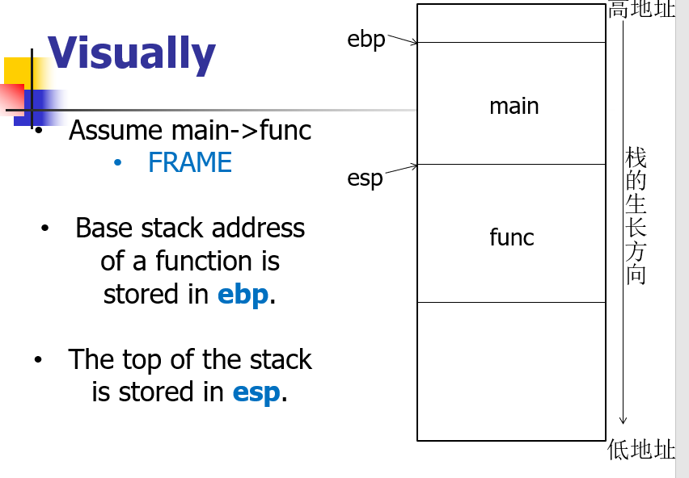
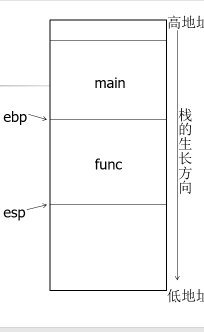
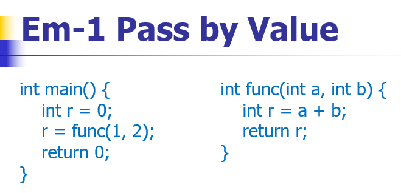
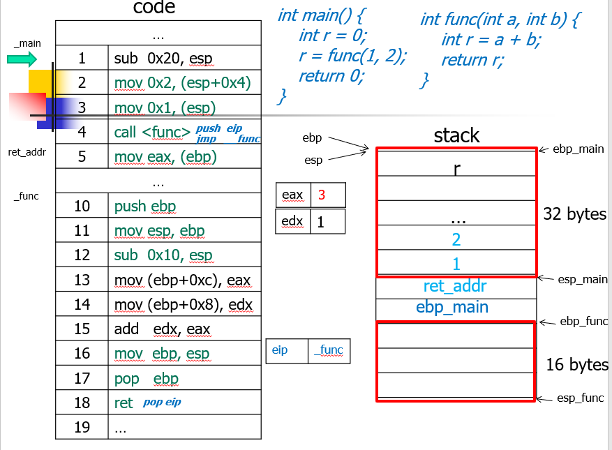
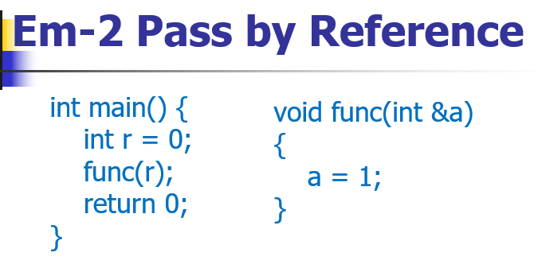
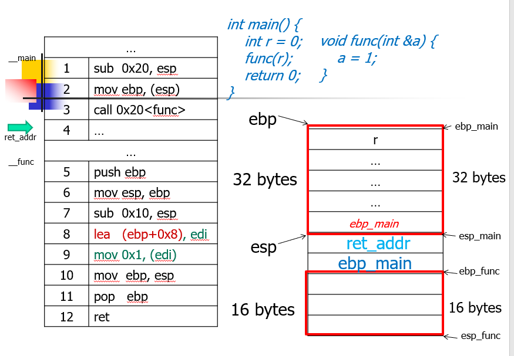

C++ 函数
---
<!-- TOC -->

- [1. 函数](#1-函数)
  - [1.1. 函数的原则](#11-函数的原则)
- [2. 函数模板](#2-函数模板)
- [3. 函数编译链接](#3-函数编译链接)
- [4. 重载(Overloading) 重写(Overriding)](#4-重载overloading-重写overriding)
  - [4.1. 函数的重载(Overload)](#41-函数的重载overload)
  - [4.2. 函数的默认参数(是对函数重载的补充)](#42-函数的默认参数是对函数重载的补充)
- [5. 外部函数 extern](#5-外部函数-extern)
  - [5.1. 符号表机制](#51-符号表机制)
- [6. 函数 与 内存](#6-函数-与-内存)
  - [6.1. 存储空间与内存](#61-存储空间与内存)
  - [6.2. RunTime Environment](#62-runtime-environment)
    - [6.2.1. _cdecl](#621-_cdecl)
    - [6.2.2. _stdcal](#622-_stdcal)
    - [6.2.3. _fastcall:](#623-_fastcall)
    - [6.2.4. 调用者和被调用者](#624-调用者和被调用者)
- [7. 函数执行机制](#7-函数执行机制)
  - [7.1. 建立被调用函数的栈空间(Stack)](#71-建立被调用函数的栈空间stack)
  - [7.2. 参数传递](#72-参数传递)
    - [7.2.1. 值传递(call by value,C、C++支持)](#721-值传递call-by-valuecc支持)
    - [7.2.2. 引用传递:函数副作用(call by reference,C++支持)](#722-引用传递函数副作用call-by-referencec支持)
    - [7.2.3. call by name](#723-call-by-name)
    - [7.2.4. call value-result:copy-restore](#724-call-value-resultcopy-restore)
  - [7.3. 保存调用函数的运行状态(额外的Cost)](#73-保存调用函数的运行状态额外的cost)
  - [7.4. 将控制转交给被调函数](#74-将控制转交给被调函数)
  - [7.5. Summary](#75-summary)
  - [7.6. 思考](#76-思考)
- [8. 函数原型](#8-函数原型)
- [9. 内外部函数划分使用](#9-内外部函数划分使用)
  - [9.1. 内部函数](#91-内部函数)
  - [9.2. 外部函数](#92-外部函数)
- [10. 内联函数inline](#10-内联函数inline)
  - [10.1. 例子](#101-例子)
  - [10.2. 使用inline的优点和缺点](#102-使用inline的优点和缺点)
  - [10.3. 问题](#103-问题)
- [11. ROP](#11-rop)
  - [11.1. 什么是 ROP](#111-什么是-rop)
  - [11.2. 参考](#112-参考)
- [12. 函数副作用](#12-函数副作用)

<!-- /TOC -->


# 1. 函数
1. 一个函数就是一个功能
2. 函数包括
   1. 系统函数(库函数)
   2. 用户自己定义的函数
       1. 无参函数
       2. 有参函数

## 1.1. 函数的原则
1. 函数不可以被**嵌套定义**:函数内部不可以再次定义新的函数
2. 函数可以通过原型完成有默认参数的函数
3. 函数是先定义后使用，具体是指上下文环境
4. `Runtime Environment`在我们C++中是使用`Stack`

# 2. 函数模板
1. `template <typename T>`
2. `T max(T a,T b, T c){}`
3. 在运行时确定T的类型
  
# 3. 函数编译链接
1. 编译只编译当前模块

```c++
g(){//a.cpp
    f();//b.cpp
}
```

2. 编译每个编译单元(`.cpp`)时是相互独立的，即每个cpp文件之间是不知道对方的存在的,`.cpp`编译成`.obj`后，link期时`a.obj`才会从`b.obj`中获得`f()`函数的信息(这就是为什么要预先)
3. link时将编译的结果连接成可执行代码，主要是确定各部分的地址,将编译结果中的**地址符号全换成实地址**(call指令在a.cpp被编译时只是call f的符号，而不知道f确切的地址)

# 4. 重载(Overloading) 重写(Overriding)
1. overload:语言的多态
2. override:父子类的，OO语言独有多态
3. 多态不是程序语言独有的，而是语言拥有的特性。
4. C++支持重载，C不支持重载。

## 4.1. 函数的重载(Overload)
1. 原则:
    1. 名称相同，参数不同(重载函数的参数个数、参数类型、参数顺序至少一个不同)
    2. 返回值类型不作为区别重载函数的依据
2. 匹配原则:
    1. 严格匹配
    2. 内部转换
    3. 用户定义的转换
3. 以下为几个例子

```c++
void bar(int i) {
	cout << "bar(1)" << endl;
}
void bar(const char c) {
	cout << "bar(2)" << endl;
}
void func(int a) {
	cout << "func(1)" << endl;
}
void func(char c) {
	cout << "func(2)" << endl;
}
void func(long long ll) {
	cout << "func(3)" << endl;
}
void hum(int i, ...) {
	cout << "hum(1)" << endl;
}
void hum(int i, int j) {
	cout << "hum(2)" << endl;
}
int main() {
	char c = 'A';
	bar(c);
	short s=1;
	func(s);
	hum(12, 5);
	hum(10, 12, 1);
	system("pause");
}
//输出结果为
//bar(2)
//func(1)
//hum(2)
//hum(1)

//下面这种是不被允许的，ambiguous
void f(long);
void f(double);            
f(10);
```

## 4.2. 函数的默认参数(是对函数重载的补充)
1. 默认参数的声明:默认参数是严格从**右至左**的顺序使用的
    1. 在函数原型中给出
    2. 先定义的函数中给出
2. 默认参数的顺序:
    1. 右->左
    2. 不间断
3. 默认参数与函数重载要注意
    + `void f(int); void f(int, int=2);`
4. 在定义中一般不给出默认参数，在调用的时候使用函数原型的时候给出默认参数。
5. 函数默认重载，在面向对象编程中，子类即便修改默认参数，也不生效。

```c++
//a.cpp中
void f(int a,int b,int c){}
//b.cpp中
void f(int,int = 2,int = 3);//使用函数原型
void g(){
    f(1);//==f(1,2,3)
    f(1,3);//==f(1,3,3)
    f(1,5,5);//==f(1,5,5)
}
```

# 5. 外部函数 extern
1. 符号表:Name mangling: extern "C"
    + 在C++的g中调用C中的f，会在link的时候出问题(因为不在C++ 的符号表中)
    + 解决方案:在函数名前面加上extern的关键词(这样子编译器就会在编译过程中从外部进行寻找)
2. C编译器编译的文件被放置在lib库中，C++不能直接调用，而是需要extern才可以
3. 原因:符号表机制

```c++
extern void f();
void g(){
    f();
}
```

## 5.1. 符号表机制
1. 符号表：与编译的各个阶段都有交互，存有函数名、地址等信息；编译时会创建一个函数符号表`<name,address>`，对应的符号后面的地址还没确定(link期决定)，call name根据name找到符号表对应的地址，再执行
2. 对于c语言来说，编译得到的符号表内函数f在符号表里的name就是f(不存在函数重载)
3. 对于c++来说，因为有重载，所以f(int)和f(float)在符号表里的name是不同的
4. c++对于c语言的函数f会按c++的方式生成函数表中的nameA，但c编译好的函数表内f对应的nameB和nameA不一致，导致c++无法找到该函数

# 6. 函数 与 内存
1. 在内存中的code，是不可以断章取义的。
2. 需要按照类型来进行
3. 函数是使用**临时性存储空间**，

## 6.1. 存储空间与内存
1. 从上往下分别是
    + code:每个指令都有对应的单元地址。函数的代码存放的位置是受到限制的
    + Data:存放数据(局部变量和全局变量)
    + Stack:由系统管理，存放函数
    + Heap:可以用程序员进行分配，可以在运行时动态确定，`int *p = (int *)malloc(4)`，归还内存`free`(在C++中不推荐使用这种方法进行处理，而是使用new和delete)
2. compiler组织成**符号表**。CPP是一个文件一个文件进行编译的。
    + 在编译A文件的时候，是不知道B文件存在的，也就是说每一个文件都是单独编译的。
    + 借助符号表来获取存储地址，问题? 函数名相同，重载(多态)的问题,解决:不仅仅按照函数名，还要**按照函数参数**来划分。
    + 所以函数表，不仅仅存储函数名，还存储函数的参数返回值类型。
3. 问题:可以在不降低可读性的前提下，降低COST吗?
4. 运行逻辑是由Runtime Environment是有差异的：注意合作方的运行环境(使用Lib的注意)

## 6.2. RunTime Environment
1. 每一个函数都有栈空间，被称为frame(active frame是当前运行函数的栈空间)
2. 以下类似是一种契约，这种约定被compiler和linker共同管理

### 6.2.1. _cdecl
1. 函数空间(参数)归**调用者**管理，本章讲解的是这种，也就是被调用者不清空栈，调用者清空栈。
2. 问题:函数调用者结束后，原空间的参数仍然在(未归还)
3. 好处:由调用者管理所有的调用参数，可以灵活管理参数
    + 例子:`printf()`函数是可变参数，根据字符串形式决定(由调用者控制):`int printf(const char * format,...)`
    + 上述例子，只能由调用者归还。
    + 无法控制传递参数的个数，写了8个%d，但是只传递了1个，则会导致调用者环境被破坏。
    + 同样的问题，就算环境不被破坏，则会导致，软件内部不应该被看到的数据被拿出来。
4. 坏处:安全问题，调用者环境被破坏。

### 6.2.2. _stdcal
1. 函数调用后，函数空间由被调用者管理，被调用者清空栈
2. 调用者来传递参数(申请空间)，由被调用者归还参数(归还空间)，这部分空间被称为**中间地带**。
3. 好处:空间节省，跨平台性：比如C++调用C的时候(C不允许重载)
4. 坏处:对于可变参数的函数无法计算ebp的参数个数，但是对于调用者是知道的，这样只能使用_cdecl

### 6.2.3. _fastcall:
1. 是一种快速调用方式，利用栈空间
2. <a href = "https://baike.baidu.com/item/__fastcall/3736920?fr=aladdin">_fastcall</a>

### 6.2.4. 调用者和被调用者
1. caller:调用者
2. callee:被调用者

# 7. 函数执行机制

## 7.1. 建立被调用函数的栈空间(Stack)



+ 栈空间是从高地址向低地址生长
+ 栈底:ebp(当前函数的存取指针，即存储或者读取数时的指针基地址)
+ 栈顶:esp(当前函数的栈顶指针)
+ 保存:返回地址、调用者的基指针
+ 过程描述:调用一个函数时，先将堆栈原先的基址(ebp)入栈，以保存之前任务的信息。然后将栈顶指针的值赋给ebp，将之前的栈顶作为新的基址(栈底)，然后在这个基址上开辟相应的空间用作被调用函数的堆栈。函数返回后，从ebp中可取出之前的esp值，使栈顶恢复函数调用前的位置；再从恢复后的栈顶可弹出之前的EBP值，因为这个值在函数调用前一步被压入堆栈。这样，EBP和ESP就都恢复了调用前的位置，堆栈恢复函数调用前的状态。



## 7.2. 参数传递

### 7.2.1. 值传递(call by value,C、C++支持)




1. 最上面是main函数，左侧，下面是Function.
2. 为什么ebp和esp之间距离很大，因为我们要**对齐**，提高内存管理效率。
3. 数据类型决定存放数据的空间的大小
4. 函数调用过程:
   1. 开始调用esp从栈顶向下移动32位，存ret_addr，开辟main函数的栈空间
   2. 然后esp继续向下存ebp_main
   3. 然后ebp到esp处
   4. 然后esp到新的函数空间的栈顶
   5. 函数处理
   6. esp先返回到ebp
   7. 然后ebp根据ebp_main返回，然后esp加一(向上)
   8. 之后esp回到ret_addr位置即可。
   9. 动画过程看PPT 50页
5.  eip 存放了ret_addr

### 7.2.2. 引用传递:函数副作用(call by reference,C++支持)
1. 传递的是地址，会同时修改对应地址单元中的值。




### 7.2.3. call by name
1. call by name 是指在用到该参数的时候才会计算参数表达式的值。
```c++
void p(int x){
    ++i;
    ++x;
}
int a[10];
int i = 1;
a[1] = 1;
a[2] = 2;
p(a[i]);
//值传递:对于i的修改会影响全局，但是不影响a[i]
//引用传递:同时影响i和a[i]
//call by name:将p函数中的x进行替换。(Delayed Evaluation)，也就是a[2] = 3;x -> a[i]
//call by name:主要是对于没有函数副作用的时候
```

### 7.2.4. call value-result:copy-restore
```c++
void p(int x,int y){
    ++x;
    ++y;
}
int a = 1;
p(a,a);
//a = 1,如果两个都为引用传递，则a=3
```

## 7.3. 保存调用函数的运行状态(额外的Cost)
+ 存储新的基指针：如上面，将ret_addr和main_esp进行存储。
+ 分配函数存储的空间
+ 执行某些功能
+ 释放不必要的存储空间

## 7.4. 将控制转交给被调函数
+ 加载调用者的基指针
+ 记载返回地址

## 7.5. Summary
1. 加载参数(进栈)
2. 保存上下文环境
    + 保存返回地址
    + 保存调用者基指针
3. 执行函数
    + 设置新的基指针
    + 分配空间(可选)
    + 执行一些任务
    + 释放空间(如果分配了的话)
4. 恢复上下文环境
    + 加载调用者基指针
    + 加载返回指针
5. 继续执行调用者的功能

## 7.6. 思考
1. 如果所有数据都放置在内存中的数据区
    + 好处:方便管理
    + 坏处:占用空间大，没有利用程序的局部性。

# 8. 函数原型
1. 遵守先定义后使用原则
2. 自由安排函数定义位置
3. 语句:只需参数类型，无需参数名称
4. 编译器检查
5. 函数原型:只需要看到函数名和参数读取到即可:`int func(int,int)`
    + 在调用点一定要能看到接口
    + 仅仅需要函数名和参数类型即可
6. 函数原型应当放置在头文件中

# 9. 内外部函数划分使用

## 9.1. 内部函数
1. static修饰

## 9.2. 外部函数
1. 默认状态的extern

# 10. 内联函数inline
1. 目的:
    1. 提高可读性
    2. 提高效率
    3. 解决了两个cost的问题
2. 对象:使用频率高、简单、小段代码
3. 实现方法:编译系统将为inline函数创建一段代码，在每次调用时，用相应的代码替换
4. 限制：
    1. 必须是非递归函数,因为已经加入主体部分了
    2. 由编译系统控制,和编译器是完全相关的
5. inline 关键字 仅仅是请求
   1. 有可能是递归，无法加入
   2. 也有可能是很复杂的函数，导致无法理解(上下文比较复杂)
6. 提请inline但是被拒绝可能是有代价的
7. 如果对象的初始化-构造函数为明确给出，计算机会给出inline的构造函数
8. 宏:`max(a,b) (a) > (b) ? (a) : (b)`：不同于inline函数，一定要有括号，因为运算数据中的优先级不同

## 10.1. 例子


1. 没有进行替换，只是将ascii函数体内操作直接进行替换。
2. 内联必须和函数体放在一起，而不是和原型放在一起，并且函数体必须出现在调用之前，否则函数可以编译，但是不出现内联。

## 10.2. 使用inline的优点和缺点
1. 只有对编译系统的提示
   1. 过大、复杂、循环选择和函数体过大的会导致被拒绝
   2. 函数指针
2. 编译器：静态函数
3. 缺点:
    1. 增大目标代码
    2. 病态的换页:**如果有过长的代码，被替换进入代码的段中，代码页在内存和磁盘中反复换页抖动**(每调用一次内联函数就会将那段代码复制到主文件中，内存增加，内存调用时原本一页的内容可能出现在第一页+第二页的一部分，**造成操作系统的"抖动"**)
    3. 降低指令快取装置的命中率(instruction cache hit rate)

## 10.3. 问题
1. 是所有的编译器都能做到inline吗?不是都能做到
2. 如果我向编译器要求inline，是否一定能做到吗？如果做不到按照正常函数进行处理
3. <a href = "https://blog.csdn.net/chunyexiyu/article/details/43673059">函数放在头文件中被多次包含的重定义问题</a>

# 11. ROP
1. 在返回地址的时候，攻击我们的程序，调整Bad_addr导致调用到坏的代码(将错误的代码注入stack中去,在传入参数的过程中传入错误的代码)
2. 防止这种攻击:禁止在执行过程中写入stack
3. 新的攻击方式:修改return前面的**短序列**(rop链攻击)
    + 使用正确代码的错误组合进行攻击
    + 如果太长，需要依赖寄存器，导致攻击困难
4. 防止这种攻击:禁止读系统中的代码
   1. 因为这种攻击需要先读出来所有的操作，然后进行组合，如果不能读出也就没有了

## 11.1. 什么是 ROP
1. 所谓ROP:就是面向返回语句的编程方式，它就用libc代码段里面的多个retq前的一段指令的一段指令拼凑出一段有效的逻辑，从而达到攻击目的。
2. 什么是retq：retq指定决定程序返回值在哪里执行，由栈上的内容决定，这是攻击者很容易控制的地址。
3. 控制参数:在retq前面执行的pop reg指令，将栈上的内容弹到指令的寄存器上，以达到预期。(重复上述操作指导达成目的)
4. 我们利用glibc进行逆向工程来查看返回前的pop指令

## 11.2. 参考
1. <a href = "https://blog.csdn.net/linyt/article/details/48738757/">使用ROP攻击技术</a>

# 12. 函数副作用
1. 函数副作用可以实现call by reference，参考scanf，而并不是通过return多参数而实现。