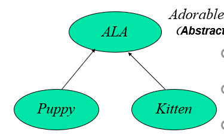

C++ 异常处理
---

<!-- TOC -->

- [1. 异常处理](#1-异常处理)
  - [1.1. 处理机制](#11-处理机制)
  - [1.2. catch的用法](#12-catch的用法)
  - [1.3. 异常处理的嵌套](#13-异常处理的嵌套)
  - [1.4. 定义异常类](#14-定义异常类)
  - [1.5. 异常处理的特例](#15-异常处理的特例)
- [2. 使用析构函数来避免造成内存泄漏](#2-使用析构函数来避免造成内存泄漏)
  - [2.1. 异常处理的例子:资源泄露【小动物收养保护中心】](#21-异常处理的例子资源泄露小动物收养保护中心)
  - [2.2. GUI应用软件中的某个显示信息的函数](#22-gui应用软件中的某个显示信息的函数)

<!-- /TOC -->

1. 错误
    1. 语法错误:编译系统
    2. 逻辑错误:测试
2. 异常 Exception
    1. 运行环境造成:内存不足、文件操作失败等
    2. 异常处理:错误提示信息等

# 1. 异常处理
1. 特征：
    1. 可以预见
    2. 无法避免
2. 作用:提高程序鲁棒性(Bobustness)
```c++
void f(char *str) {//str可能是用户的一个输入
    ifstream file(str);
    if (file.fail()) {
        // 异常处理
    }
    int x;
    file >> x;
}
```
1. 问题:发现异常之处与处理异常之处不一致，怎么处理?函数中的异常要告知调用者
2. 常见处理方式:
    1. 函数参数:
        + 返回值(特殊的，0或者1)
        + 引用参数(存放一些特定的信息)
    2. 逐层返回
3. 缺陷:程序结构不清楚
4. 相同的异常，不同的地方，需要编写相同的处理了逻辑是不合理的
5. 传统异常处理方式不能处理构造函数出现的异常

## 1.1. 处理机制
1. C++异常处理机制是，一种专门、清晰描述异常处理过程的机制
2. try：监控
3. throw：抛掷异常对象，不处理
4. catch：捕获并处理
```c++
try{
    //<语句序列>
    //监控
}throw//<表达式>，可以是基本类型，拷贝构造函数用来拷贝类
catch(<类型>[<变量>]){//变量不重要可以省略
    //<语句序列> 捕获并处理
    //依次退出，不要抛出指向局部变量的指针，解决:直接抛出对象，自动进行拷贝
}
```

## 1.2. catch的用法
1. 类型:异常类型，匹配规则同函数重载(精确匹配只有底下三种，int转double都不行)
   1. 允许从非常量到常量转换
   2. 允许从派生类到基类转换
   3. 允许数组和函数转换成指针
2. 变量:存储异常对象，可省
3. 一个try语句块的后面可以跟多个catch语句块，用于捕获不同类型的异常进行处理
```c++
void f() {
    throw 1;
    throw 1.0;
    throw "abcd";
}
try {
    f();
}catch (int)// 处 理 throw 1;
{...}
catch(double)//throw 1.0
{...}
catch(char *)//throw "abcd"
//字符串优先解释为char *
{...}     
```

## 1.3. 异常处理的嵌套
1. 调用关系:f->g->h

```c++
//第二节课10min
f(){
    try{
        g();
    }catch (int)
     { … }
    catch (char *)
    { … }
}
g(){
    try{
        h();
    }catch (int)
    { …  }
}
h(){
  throw 1;   //由g捕获并处理
  throw "abcd"; //由f捕获并处理
}
```

1. 如果所抛掷的异常对象如果在调用链上未被捕获，则由系统的abort处理,尽量不要

## 1.4. 定义异常类
1. 注意catch块排列顺序：这样子保证了继承顺序(重要)，顺序向下检查是否符合条件，一旦符合条件就不再向下查找了。
```c++
class FileErrors { };
class NonExist:public FileErrors { } ;
class WrongFormat:public FileErrors { } ;
class DiskSeekError:public FileErrors { };

int f(){
    try{
        WrongFormat wf;
        throw wf;
    }catch(NonExists&){...}
    catch(DiskSeekError&){...}
    catch(FileErrors){...}//最后一个可以接住，派生类像基类转换是允许的
}
int f(){
    try{
        WrongFormat wf;
        throw wf;
    }catch(FileErrors){...}//这样子底下都捕获不到
    catch(NonExists&){...}
    catch(DiskSeekError&){...}
}
//Catch exceptions by reference
//尝试多继承，而不是拷贝，避免冗余
```

2. 实例:
```c++
class MyExceptionBase {};
class MyExceptionDerived: public MyExceptionBase { };
void f(MyExceptionBase& e) {
    throw e;//调用拷贝构造函数
}
int main() {
    MyExceptionDerived e;
    try {
        f(e);
    }catch(MyExceptionDerived& e) {
        cout << "MyExceptionDerived" << endl;
    }catch(MyExceptionBase& e) {
        cout << "MyExceptionBase" << endl;
    }
}
//输出:MyExceptionBase，为什么?调用了拷贝构造函数，拷贝构造的结果是MyExceptionBase类型的对象
```

## 1.5. 异常处理的特例
1. 无参数 throw:将捕获到的异常对象重新抛掷出去`catch(int){throw;}`
2. catch(...):默认异常处理,这三个点是标准语法,捕获所有异常
3. 实现:不影响对象布局:程序状态<->析构函数、异常处理器，对程序验证特征的支持
4. 构造函数的初始化表前，放置try-catch同样捕获异常1

```c++
//对程序验证特征的支持
template<class T, class E>
inline void Assert(T exp, E e)
{
    if (DEBUG)
        if (!exp) throw e;
}
```
5. 问题:如何应对多出口引发的处理碎片问题，如果多个地方throw，则意味着这里有多个出口。
6. Java中在异常处理这一部分提供了Finally操作，无论在哪里没有抛出最后都会执行finally，将内存缓存进行自己的处理
7. 可是C++中没有finally,那怎么进行处理呢?这个在C++中，执行完异常处理后，必然执行析构函数

```c++
//Know what functions C++ silently writes and calls
class Empty { }; 
class Empty {
    //以下是C++默认提供给空类的方法
    Empty();
    Empty(const Empty&);
    ~Empty();
    Empty& operator=(const Empty&);
    Empty *operator &();
    const Empty* operator &() const;
};
```

# 2. 使用析构函数来避免造成内存泄漏

## 2.1. 异常处理的例子:资源泄露【小动物收养保护中心】
1. 收养中心每天产生一个文件，包含当天的收养个案信息
2. 读取这个文件，为每个个案做适当的处理



```c++
class ALA{//Adorable Little Animal
    public:
        virtual void processAdoption() = 0;
};
class Puppy: public ALA{
    public:
        virtual void processAdoption();
};
class Kitten: public ALA{
    public:
        virtual void processAdoption();
};
void processAdoptions(istream& dataSource){ 
    while (dataSource){
        ALA *pa = readALA(dataSource);
        try{
            pa->processAdoption();//处理可能会出现问题
        }catch (…){
            delete pa;
            throw;
        }
        delete pa;//正常执行也要进行处理，这就是多出口的问题
    }
}
```

- 结构破碎:被迫重复"清理码"2次delete的pa(不符合集中式处理的想法、同时容易导致维护困难的问题)
- 集中处理？用析构函数(智能指针)

```c++
template <class T>
class auto_ptr{
    public:
        auto_ptr(T *p=0):ptr(p) {}
        ~auto_ptr() { delete ptr; }
        T* operator->()  const { return ptr;}
	    T& operator *()  const { return *ptr; }
    private:
        T*  ptr;
};
//结合智慧指针使用
void processAdoptions(istream& dataSource){
    while (dataSource){
        auto_ptr<ALA> pa(readALA(dataSource));
        pa->processAdoption();//只要对象结束，就会自动delete
    }
}
```

## 2.2. GUI应用软件中的某个显示信息的函数
1. handle class:句柄类，就是处理智能指针
```c++
void displayInfo(const Information& info){  
    WINDOW_HANDLE w(createWindow());//针对windows窗体的一个指针，createWindow:返回一个窗体指针，WINDOW_HANDLE是别名
    display info in window corresponding to w;
    destroyWindows(w);
}
//专门的句柄类，处理窗体问题
class WindowHandle{
    public:
	    WindowHandle(WINDOW_HANDLE handler) : w(handler) {}
    	~WindowHandle() { destroyWindow(w);}//析构就会自动释放资源
        operator WINDOW_HANDLE() { return w; }//重载类型转换操作符，转换为WINDOW_HANDLE指针，将句柄类对象和包含的句柄一样的进行使用
    private:
        WINDOW_HANDLE w;
        WindowHandle(const WindowHandle&);
        WindowHandle & operator = (const WindowHandle&);
};
void displayInfo(const Information& info){
    WindowHandle  w(createWindow())
    //display info in window corresponding to w;
}
```

1. 第9、10课需要仔细听一下