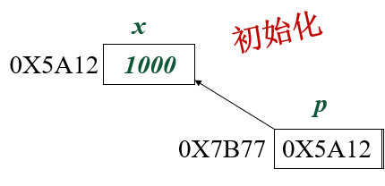
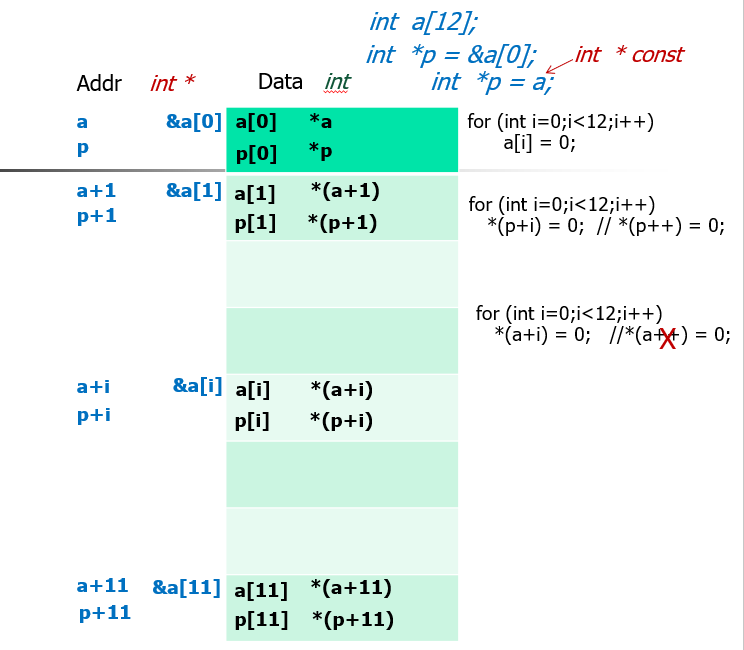
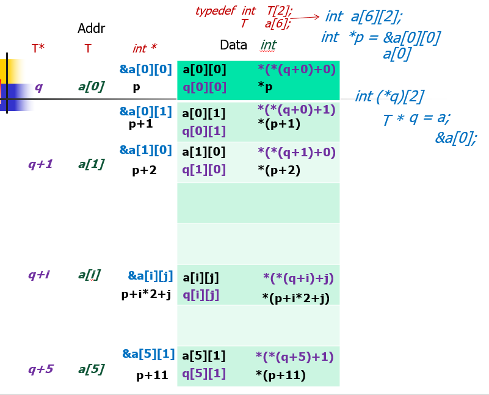
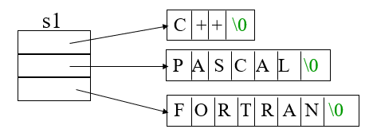
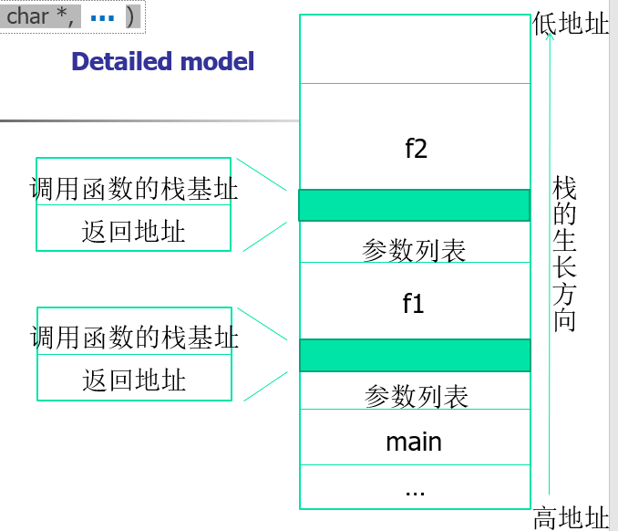
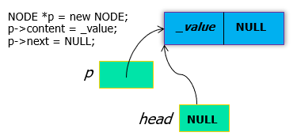
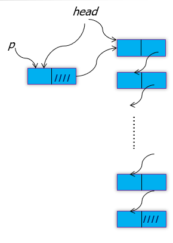
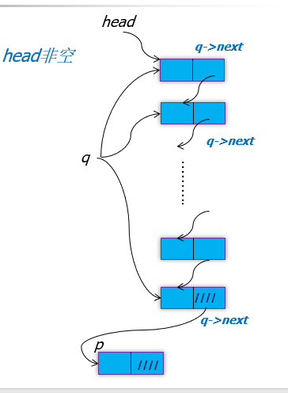

C++ 指针
---
1. C++中的指针主要是**管理地址信息**
    1. 管理数据
    2. 调用代码

<!-- TOC -->

- [1. 指针定义与基本操作](#1-指针定义与基本操作)
  - [1.1. 基本操作](#11-基本操作)
  - [1.2. 指针之间的运算](#12-指针之间的运算)
    - [1.2.1. memset()的部分具体解释](#121-memset的部分具体解释)
  - [1.3. 常量指针与指针常量](#13-常量指针与指针常量)
    - [1.3.1. 常量指针](#131-常量指针)
    - [1.3.2. 实例说明指针](#132-实例说明指针)
    - [1.3.3. 指针常量](#133-指针常量)
- [2. 指针与函数](#2-指针与函数)
  - [2.1. 函数指针实现框架(如何写一个框架)](#21-函数指针实现框架如何写一个框架)
    - [2.1.1. 第一版:高耦合版本](#211-第一版高耦合版本)
    - [2.1.2. 第二版:剥离IO部分](#212-第二版剥离io部分)
    - [2.1.3. 第三版:抽离计算部分](#213-第三版抽离计算部分)
    - [2.1.4. 最后一版:主方法集成](#214-最后一版主方法集成)
  - [2.2. 函数指针实现泛型](#22-函数指针实现泛型)
    - [2.2.1. 冒泡排序第一版:默认int型排序](#221-冒泡排序第一版默认int型排序)
    - [2.2.2. 冒泡排序第二版:扩展复杂数据类型](#222-冒泡排序第二版扩展复杂数据类型)
    - [2.2.3. 冒泡排序第三版:使用泛型函数实现调用部分](#223-冒泡排序第三版使用泛型函数实现调用部分)
    - [2.2.4. 冒泡排序另一种实现:简单数据类型](#224-冒泡排序另一种实现简单数据类型)
    - [2.2.5. lambda表达式](#225-lambda表达式)
  - [2.3. 函数指针](#23-函数指针)
    - [2.3.1. 一维数组](#231-一维数组)
    - [2.3.2. 二维数组](#232-二维数组)
- [3. 指针与数组](#3-指针与数组)
  - [3.1. 降维操作](#31-降维操作)
  - [3.2. 升维操作(重要)](#32-升维操作重要)
  - [3.3. 指针数组](#33-指针数组)
  - [3.4. 可变参数](#34-可变参数)
  - [3.5. 实现Myprint](#35-实现myprint)
- [4. 指针与结构](#4-指针与结构)
- [5. 多级指针](#5-多级指针)
- [6. 动态变量](#6-动态变量)
  - [6.1. 申请动态变量](#61-申请动态变量)
    - [6.1.1. 使用malloc分配空间](#611-使用malloc分配空间)
    - [6.1.2. 分配连续空间(涉及多维数组)](#612-分配连续空间涉及多维数组)
    - [6.1.3. 面向对象中的new关键字](#613-面向对象中的new关键字)
  - [6.2. 归还动态变量](#62-归还动态变量)
  - [6.3. 动态变量的应用](#63-动态变量的应用)
  - [6.4. 单链表 - 应用](#64-单链表---应用)
    - [6.4.1. 单链表的插入](#641-单链表的插入)
    - [6.4.2. 单链表的删除](#642-单链表的删除)
  - [6.5. 单向排序链 -- 应用](#65-单向排序链----应用)
    - [6.5.1. 释放单向排序链](#651-释放单向排序链)
    - [6.5.2. 打印单向排序链](#652-打印单向排序链)
    - [6.5.3. 插入单向排序链](#653-插入单向排序链)
    - [6.5.4. 删除单向排序链](#654-删除单向排序链)
- [7. C++引用](#7-c引用)

<!-- /TOC -->

# 1. 指针定义与基本操作
1. 定义:`<基类型>*<指针变量>`:`void*`:可以作为所有指针的接口，void的指针类型可以被赋值为任何类型的指针。
```c++
int a = 9;
int* p = &a;
int* q = p;//指向同一地址
*p = 8;

void* p1 = p;
double* q1;
p1 = q1;//是允许的
```
2. 使用typedef来定义一个指针类型(别名)
```c++
typedef int* Pointer;
// p和q均为指针变量
Pointer p, q;
//等价于
int*p, q;//主要q是int不是指针
```
3. 可以直接进行赋值:因为C++可以进行系统开发，所以一定是可以操作绝对地址的。
   1. `int *p = (int *)0x080483A0;`
   2. `int *p = 0x080483A0;`

## 1.1. 基本操作
1. 取地址:`&`
2. 间接取内容:`*`
```c++
int x=9; 
int *p;
p = &x;
*p = 1000;
```



3. 所有的指针都要初始化(Pointer Literal)
    + C++会初始化指针为0(默认初始化)，如果编译器发现指向为0，则报错，因为0地址是保留空间
    + 不允许:`char *p = (void*)`
    + 在新的C++部分中，我们引入了`nullptr`:作为不依赖任何值的指针。`Pointer p = nullptr;`

```c++
//ANSI C
#define NULL ((void*)0)
//C++
#define NULL 0
//以下的情况，会调用int的重载版本
void func(int);
void func(char*);
func(NULL);
```

4. 空指针并不一定用与整数0同样的二进制模式表示，可由实现者采用任何选定的方式表示。
5. 赋值:同类型赋值:`p = &d//error，不同类型`
6. 加减:整形
    1. 结果类型:不变
    2. 数值:sizeof(**基类型**) * 整形数值
    3. char*是一个一个走

```c++
int* p ;
double *q;
//注意这里的++隐含的意义是加上一个sizeof(type)
p++;//p的值加4  (sizeof(int))
q++;//q的值加8  (sizeof(double)) 
```

## 1.2. 指针之间的运算
1. 同类型指针相减(**仔细看offset的定义**)
    1. 结果类型:整形
    2. 数值:偏移量

```c++
int a[10] = { 1,2,3,4,5,6,7,8,9,10 };
int *p = &a[0];
for (int i = 0; i < 10; i++) {
	cout << *p++ << " ";//指针移动
	cout << *p << " ";
	cout << *(p + i) << endl;//指针不动
	for (int j = 0; j < 10; j++) {
		cout << a[j] << " ";
	}
	cout << endl;
}
```
2. 同类型指针比较:
    1. == 或者 !=
    2. 一般不使用 > 等符号

```c++
int  x=1;
int *p=&x;
cout << p;    // p的值 (x的地址)
cout << *p;   // p所指向元素的值
char *p = "ABCD";//有问题
char *p = (char *) "ABCD"//没有问题，但是并不推荐这么使用
cout << p;//p指向的字符串，即: ABCD
//调用ostream& operator << (ostream&, char*)
//调用时，operator << (cout,p);
cout << *p;    //p指向的字符，即：A
cout << (int *)p   //p的值
```
1. void* 
    1. 只管理地址信息`void *p;`
    2. 是指针类型的公共接口
    3. 任何操作须做强制类型转换(不然是没有意义的)

```c++
void *any_pointer;
int x;
double y;
any_pointer = &x;
any_pointer = &y;
*any_pointer //error,对void*类型的指针取值的时候，一定要先转换为对应具体类型的指针后再进行取值

*((int *)any_pointer)    //OK
*((double *)any_pointer) //OK
```

4. 指针可用来将某块内存清零
```c++
//例：将某块内存清零，按照bit进行处理！
void  memset ( void *pointer, unsigned size) {
    char *p = (char *)pointer;
    for (int k=0;k<size;k++)
        *p++ = 0;
}
void memcpy(void *des, void *src, unsigned size) {
	//进行内存拷贝
	char *sp = (char *)src;
	char *dp = (char *)des;
	for (int i = 0; i < size; i++) {
		*dp++ = *sp++;
	}
}
void showBytes(void *q, int n)//查看内存
{
	cout << n << endl;
	unsigned char *p = (unsigned char *)q;
	for (int i=0; i<n; i++){
        cout << (void *)(p+i) << " : "<< setw(2) << hex << (int)*(p+i) << " ";
	if ( (i+1) %4 ==0 ) cout << endl;
	}
	cout << dec << endl;
}
```

### 1.2.1. memset()的部分具体解释
1. 通常是为申请内存进行初始化的操作
2. 可以将int数组的空间初始化为0或者-1
3. 函数原型:`memset(void *s,int ch,size_t n);`

```c++
struct A{...};
A a;
memset(&a,sizeof(A));
int A[100];
memset(&a[0],100);

int arr[100] = {0};
memset(arr,sizeof(arr));
memset(arr,100 * sizeof(int));//arr作为参数传递时
```

## 1.3. 常量指针与指针常量
1. 操作地址一定要保证存在并且有意义

### 1.3.1. 常量指针
1. `const <类型> * <指针变量>`
2. 不可以修改指针指向单元的内部的值
```c++
const int c = 0;
const int *cp;
int y = 1;
int *q;
cp  = &c; √//cp 可以指向 c
q   = &y; √//q  可以指向 y
*cp = 1 ; ×//*cp 是一个常量,不可以赋值
*q  = 2 ; √//变量指针可以指向变量
cp  = &y; √//常量指针可以指向变量，传递的是y的空间，并且对于y的这个空间只是可读的，安全的  
q   = &c; ×//不可以的，因为q的修改可以间接修改c，所以编译器不允许

void print(int *p){
    cout << *p << endl;
}

const int c = 8;
print(c) ;//不可以被调用的
print(&c);//C++赋给的权利，在调用的时候除去常量的特性，这个&是强制类型转换，取消常量特性
void print(const int *p){//如此修改就可以大量复用
    //常量使用者和变量使用者都可以使用
    cout << *p << endl;
}
```
1. 常量指针指向的地址存储的值不可以被修改，用来消除函数的副作用，保证在函数端中只读数据。
2. cp(variable) -> c(constant)
3. 服务提供者**Use const whenever possible**(cp = &y可以保证函数不修改参数中的值):让调用者直接访问被调用者空间中的数据，为了保证不可以修改数据，使用const

```c++
void Fun1(int *p){
    //*p 读写
}
void Func2(const int *p){
    //*p 只读
}
```

5. 面向对象中没有const会带来很大的访问权限的问题

### 1.3.2. 实例说明指针
```c++
int x=10;
int *p = &x;
cout << " x " << &x  << x << endl;
cout << " p " << &p << p << endl;
cout << "*p " << p <<  *p << endl;//*p = x
//Name   Addr    Value
//x    0012FF7C   10
//p    0012FF78   0012FF7C
//*p   0012FF7C   10

const int c = 128;
int * q = const_cast<int *>(&c);//强制类型转换
*q = 111;//企图通过变量指针修改常量
cout << " c " << &c << c << endl;
//这里的c是符号常量，所以在编译的时候，符号常量已经变为128了，相当于define
cout << " q " << &q << q << endl;
cout << "*q " << q << *q << endl;
//Name   Addr     Value
//c    0012FF74    128
//q    0012FF70    0012FF74
//*q   0012FF74    111
//why?为什么这个单元对于c是128，而对于q这个单元是111，见上面，确实已经修改成111了

void showBytes(void *q, int n)//查看内存
{
	cout << n << endl;
	unsigned char *p = (unsigned char *)q;
	for (int i=0; i<n; i++){
        cout << (void *)(p+i) << " : "<< setw(2) << hex << (int)*(p+i) << " ";//这里是很重要的
	if ( (i+1) %4 ==0 ) cout << endl;
	}
	cout << dec << endl;
    //cout利用控制符dec、hex和oct，分别输出十进制、十六进制和八进制显示整数
}
```

### 1.3.3. 指针常量
1. `<类型>* const<指针变量>`
2. 在定义时初始化
3. p(constant)->x(variable)
```c++
int x,y;
int *const p = &x;//p就始终如一的指向x这个单元
//同时这个单元是可变的

p = &y;//错误的
```
4. const int * const p是非常强的指针约束

# 2. 指针与函数
1. 指针作为形参
    1. 提高传输效率
    2. 函数副作用
    3. 常量指针
2. 程序基本组织单位就是函数
3. 进阶:Function Pointer指向函数的指针

```c++
int A[2];
typedef int T[2];//相当于int[2] T

double (*fp)(int);//fp是指向函数的指针
double (int) * fp;//上面的理解，不能这么写
double *fp (int);//符合C++语法，fp是一个函数，参数是int，返回值是double*

typedef double (*FP)(int);
typedef double (*)(int) FP;//上面那个的理解

double f(int x){}
int g(){}
void main(){
    FP fp;
    fp = f;   //相当于fp = &f;为函数指针赋值
    (*fp)(10);//相当于fp(10);
    fp = g;  //Error
}
```
1. (*fp)就是函数的执行

## 2.1. 函数指针实现框架(如何写一个框架)
1. 一个计算任务的执行(加法/减法)
2. 是一个前缀输入

### 2.1.1. 第一版:高耦合版本
```c++
#include <iostream>
using namespace std;

int add(int a,int b) {return a+b;}
int minus(int a,int b) { return a-b; }

void main(){
	char c; 
	int op1, op2;
	cin >> c;
	while (c != '#'){//#是终止符
        //类似Windows中的一些时间的参数
        //以下对应getTask()
        cin >> op1;
	    cin >> op2;
        //以下对应executeTask()
        switch (c){
            case '+': cout << add(op1,op2) << endl;
		        break;
	        case '-': cout << minus(op1,op2) << endl;
		        break;
	    }
   	    cin >> c;
	}
}
```

### 2.1.2. 第二版:剥离IO部分
```c++
//剥离IO getMessage，和操作系统一样
struct Task{
    int op1;
    int op2;
    OPRAND_TYPE op;
};

enum OPRAND_TYPE { END=-1,  ADD,  MINUS};
int add(int a,int b)   { return a+b; }
int minus(int a,int b) { return a-b; }
//add 和 minus 抽象成函数指针
typedef  int (*FP)(int, int);

OPRAND_TYPE getTask(Task &task){
    char c;
    cin >> c;
    switch (c){
        case '#':
            task.op = END;
            break;
        case '+':
            task.op = ADD; 
	        cin >> task.op1;
	        cin >> task.op2;
	        break;
        case '-':
            task.op = MINUS; 
	        cin >> task.op1;
	        cin >> task.op2;
	        break;
    }
    return task.op;
}
```

### 2.1.3. 第三版:抽离计算部分
```c++
//抽离计算部分第一版
//如何修改可以使得无论多少个任务都不导致如下方法的修改
void executeTask(const Task task){
    FP fp;
    switch(task.op){
        case ADD: fp = app;break;
        case MINUS : fp = minus;break;
    }
    fp(task.op1,task.op2)
}
//抽离计算部分第二版代码
//Table Driven
FP op[2] = {add, minus};
void executeTask(const Task task){
    op[task.op](task.op1,task.op2);
}
```

1. 此时发生修改，我们只需要修改枚举类型和函数类型

### 2.1.4. 最后一版:主方法集成
```c++
void main()
{
    Task task;
    while (getTask(task) != END)
        executeTask(task);//call by reference
}
//组织改善:利用define，集合IDE
//完成时间处理、协议解析、服务框架
```

## 2.2. 函数指针实现泛型

### 2.2.1. 冒泡排序第一版:默认int型排序
```c++
//第一版实现冒泡排序，默认数据类型为int
void MySort(int A[],unsigned int num)
{
    for (unsigned i=1;i<num;i++){
        for (unsigned j=0;j<num-i;j++)
            if(A[j] > A[j+1]){
                int tmp = A[j];
                A[j] = A[j+1];
                A[j+1] = tmp;
            }
    }
}
```

### 2.2.2. 冒泡排序第二版:扩展复杂数据类型
1. 每一个数据块的大小可能是不确定的，所以我们需要确定每一个块的大小(width)
2. void * base对应首地址
3. 解决序关系的处理
4. 解决数据块的交换
```c++

void MySort(void *base, unsigned width,unsigned num，int(*compare)(const void *elem1,const void *elem2)){//这部分意味着我们必须要传入一个compare的函数
    char *A = (char*) base;//void* 是不可以进行移动的
    char *tmp = (char*)malloc(width);//申请堆空间
    for (unsigned i=1;i<num;i++){
        for (unsigned j=0;j<num-i;j++)
            if (compare(A + j * width,A + (j+1)*width) > 0){//序关系由函数确定
                memcpy(tmp,A + j * width,width);//tmp = A[j]
                memcpy(A + j * width,A+(j+1)*width,width);//A[j] = A[j+1]
                memcpy(A + (j + 1) * width,tmp,width);//A[j + 1] = tmp
            }
    }
    free(tmp);//释放这部分的空间
}
```
### 2.2.3. 冒泡排序第三版:使用泛型函数实现调用部分
```c++ 
struct TStudent
{   char name[20];
    int age;
};
TStudent student[] = {...};
int num = sizeof(student)/sizeof(student[0]);//计算出来有多少个
int width = sizeof(student[0]);//计算出来宽度
MySort(student, width, num, icompare);
MySort(student, width, num, scompare);
//compare不用给大小，因为compare是调用者给出的，显然不用给出width了
//call back function：在运行中反过来调用
int icompare(const void *elem1, const void *elem2){
    TStudent *p1 = (TStudent *)elem1;
    TStudent *p2 = (TStudent *)elem2;
    return p1->age - p2->age;
}
int scompare(const void *elem1, const void *elem2){
    TStudent *p1 = (TStudent *)elem1;
    TStudent *p2 = (TStudent *)elem2;
    return strcmp(p1->name, p2->name);
}
```

### 2.2.4. 冒泡排序另一种实现:简单数据类型
```c++
template <class T>
void MySort(T A[],unsigned T num)
{
    for (unsigned i=1;i<num;i++){
        for (unsigned j=0;j<num-i;j++)
            if(A[j] > A[j+1]){
                T tmp = A[j];
                A[j] = A[j+1];
                A[j+1] = tmp;
            }
    }
}
int a[100];
sort(a,100);//此时的T转换成为int(对应类型)
class C{...}
C a[300];
sort(a,300);//编译器可以将其变为C,但是有问题
//我们需要重载>运算符
```

### 2.2.5. lambda表达式
直接给出即可

## 2.3. 函数指针
1. 计算一元函数在某区间上的定积分

```c++
#include <math.h>
double integrate(double (*f)(double),double a, double b)
{ … f(x),  a ,  b, …  }
double my_func(double x){ … }
void main(){
    integrate(sin,0,1);
    integrate(cos,1,2);
    integrate(my_func,1,10);
}
```

### 2.3.1. 一维数组


1. 注意右侧的第二个部分:可以控制p的移动情况
2. `*(p+i)`:p不移动
3. `*(p++)`:p移动
4. `int *p = a`:这时候a表示的是数组的首地址
    + 这里传递的是`int * const`
    + a[0]可以写为p[0]

```c++
void f(int A[],int n){
    sizeof(A)/sizeof(A[0])//始终1，就是地址
}
```

1. `sizeof(a)`:是数组的整个块的大小
2. `sizeof(a[0])`:是数组中一个元素的大小

### 2.3.2. 二维数组



1. 二维数组用一维方式访问
2. `int *p = &a[0][0]`:p指向的是T类型

```c++
for(int i = 0;i < 12;i++){
    *(p++) = 9;//越界了(对应一维数组的越界)，但是二维数组没有越界
}
```
```c++
typedef int T[2];   
T a[6];//int a[6][2]
T *q = a;
//不使用T的方法
int[2] *q;
```

# 3. 指针与数组
1. 数组元素操作:下标表达式和访问效率
    1. a[i] == *(a+i)
    2. &a[i] == a+i

```c++
int a[10];
sizeof(a);//数组大小
sizeof(a+1);//内存地址的长度，单位bytes
int *p;
int i=0;

p = &a[0] == p = a;    

a[i] == *(a+i) == *(p+i) == p[i]
&a[i] == a+i == p+i == &p[i]
```

2. 多维数组
```c++
int b[20][10];
//等价于
//typedef int T[10];
//T b[20];
int *q;
q = &b[0][0];// q = b[0]
//b[i][j] == *(&b[0][0] + i*10 + j) == *(q + i * 10 + j) == q[i*10 + j]
T * p;//int (*p)[10];
p = &b[0];// p = b
//b[i][j] == *(*(b+i)+j) == *(*(p+i)+j) == p[i][j]
```

3. 通过指针和数组元素存储的关系来快速访问数组元素

## 3.1. 降维操作
1. 越界操作:C++认为是允许的，只要这块内存空间在我们的控制范围内即可

```c++
#include <iostream.h>
int  maximum(int a[], int n)
{
    int max = 0;
    for(int k=0;k<n;k++)
        if (a[k] > max)
			max = a[k];  
	return max;
}
void main()
{
    int  A[2][4] = { {68,69,70,71} , {85,86,87,89}};
    cout << "the max grade is" << maximum(A[0],2*4);//maximum(&A[0][0],2*4) =>maximum(&A[0][0],sizeof(A)/sizeof(A[0][0]))
}	
```

## 3.2. 升维操作(重要)
1. 因为申请内存空间的时候只能申请到线性部分

```c++
void show(int a[],  int n){
    for (int i=0;i<n;i++)  {
        cout << a[i] << " ";
        cout << endl;
    }
    cout << endl;
}
void show(int a[][2], int n){
    for (int i=0;i<n;i++)  
        for (int j=0;j<2;j++) {
            cout << a[i][j] << " ";
            cout << *(a+i)+j << " :" << a[i][j] << " ";
            //四个换一行
            if ((i*2+j+1)%4 == 0)
                cout << endl;
        }
    cout << endl;
}
void show(int a[][2][3], int n){
    for (int i=0;i<n;i++)  
        for (int j=0;j<2;j++)
            for (int k=0;k<3;k++){
                cout << a[i][j][k] << " ";
                cout << *(*(a+i)+j)+k << " :" << a[i][j][k] << "  ";
                //换行输出
                if ((i*6+j*3+k+1)%4 == 0)
                    cout << endl;
            }
	cout << endl;
}

void main(){
    int b[12];
    for (int i=0;i<12;i++)  b[i] = i+1;
    show(b,12);
    //二维数组
    typedef int T[2];
    show((T*)b,6);//show((int (*)[2])b,6),一定有括号

    //三维数组
    typedef int T1[3];
    typedef T1 T2[2];
    show((T2*)b,2);//show((int (*)[2][3])b,2)
}
```

## 3.3. 指针数组
1. main函数:`int main(int argc,char * argv[],char * env[])`
    + argc:参数个数(包含命令)
    + argv:命令行参数
    + env:环境参数(为什么这个不必指出长度?因为\0结束，一个结束符)

2. Eg.
```
ping  -t  192.168.0.1
argc : 3
argv:  ping / -t / 192.168.0.1
env：
```

3. 数组中的元素为指针(以下两种方式实现是不同的:内存空间的分配)

```c++
char *s1[] = {"C++", "PASCAL", "FORTRAN"};
char s2[][8] = {"C++", "PASCAL", "FORTRAN"};
```



## 3.4. 可变参数
1. `int printf(const char*,...)`:后面是可变参数，由调用者决定。
2. `const char*`:是调用者和被调用者之间的约定



3. printf("%d%c",x,y);
    1. 少写一个也没问题
    2. 这种约定是不受保护的，给出参数个数和类型，表示如何取
    3. active frame:之前的active frame地址要保存下来

## 3.5. 实现Myprint
1. alignment的说明(内存地址)
```
目标求Q
X = Qn + r, -n < r <= 0 Q大于X，能放下，并且是整数倍
思考:X = qn + r, 0 <= r < n
    q = x/n
    r = x%n
    这样子就能求了

X + n - 1 = Qn + r1, 0 <= r1 < n
       Qn = ((x + n - 1)/ n) * n
n 是 2 的幂次 => 左移右移都是乘以或者除以2
n = 2 的 m 次方
所以先乘以2再除以2，相当于后m为全部清0
也就等价于(x+n-1) & (~(n-1))
```

2. 具体的内存C++实现
```c++
//platform : x86 宏的说明，这不是在库文件中已经定义了的
typedef  char *va_list; 　　
#define  _INTSIZEOF(x)  ((sizeof(x) + sizeof(int) - 1) & ~(sizeof(int) - 1)) //alignment 偏移的大小
#define  va_start(ap,v) ( ap = (va_list)&v + _INTSIZEOF(v) )
#define  va_arg(ap,t)   ( *(t *)((ap += _INTSIZEOF(t)) - _INTSIZEOF(t)))
#define  va_end(ap)     ( ap = (va_list)0)

#include <iostream>
#include <stdarg.h>
using namespace std;

void MyPrint(char *s, ...){
    va_list marker;//拿到一个指针
    va_start(marker,s);//找到参数的位置，s的位置
    int i=0;
    char c;
    while ((c=s[i]) != '\0'){
        if (c != '%')
            cout << c;
        else{
            i++;
            switch (c=s[i]){
                case 'f': cout << va_arg(marker,double); break;
                case 'd': cout << va_arg(marker,int);break;
                case 'c': cout << va_arg(marker,char);break;
		    }
	    }
   	    i++;
    }
    cout << endl;
    va_end(marker);//将当前指针回归原始状态          
}
int max(int num, ...) {
	va_list marker;//拿到一个指针
	va_start(marker, num);
	int maxNum = 0;
	int tmp = 0;
	for (int i = 0; i < num; i++) {
		tmp = va_arg(marker, int);
		if (tmp > maxNum) {
			maxNum = tmp;
		}
	}
	va_end(marker);//将当前指针回归原始状态      
	return maxNum;
}
void main(){
	MyPrint("double: %f integer: %d string: %c ",1.1, 100, 'A');
    cout << max(5,10,20,50,30,40);
}
```

1. 格式化串攻击:偷摸摸搞到其他部分的内存

# 4. 指针与结构
1. 结构成分的访问:`(*p).x == p->x`
2. 结构作为函数参数:
    1. 大块数据传输
    2. const

# 5. 多级指针
1. 基类型为指针类型
2. 指向指针的指针
3. 编写一个函数交换两个字符串

```c++
void myswap(int *p1, int *p2) {
	int* tmp = p1;
	p1 = p2;
	p2 = tmp;
}
void myswap2(int &p1, int & p2) {
	int tmp = p1;
	p1 = p2;
	p2 = tmp;
}
void myswap(char **p1, char **p2) {
	char *tmp = *p1;
	*p1 = *p2;
	*p2 = tmp;
}
void main()
{
	char *p1 =(char*) "abcd";
	char *p2 =(char*) "1234";
	int a = 100;
	int b = 200;
	myswap(&a, &b);
	cout << a << " " << b << endl;//100 200
	myswap2(a, b);
	cout << a << " " << b << endl;//200 100
	myswap(&p1, &p2);
	cout << p1 << " " << p2 << endl;//1234 abcd
}
```

# 6. 动态变量
1. 动态:
    1. 大小
    2. 生命周期
2. 非编译时刻确定
3. 是在heap中申请存储空间

## 6.1. 申请动态变量
1. `new <类型名> [<整型表达式>]`
2. malloc也可以用来申请动态变量(但是建议使用new)
3. new和malloc两者区别:
    1. 语法:强制类型转换
    2. 语义:构造函数
4. 申请内存的时候有可能会申请失败:
    1. new之后一定要判断p是不是NULL
    2. 如果不是NULL，一定是有效的

```c++
//--------------------------------------
int x;
int *p = new int;
delete p;
int *p = (int *)malloc(sizeof(int));
free(p);
int &a = p;
```

### 6.1.1. 使用malloc分配空间
```c++
//malloc
void * malloc (unsigned int size)
p = (int *)malloc(sizeof(int));	  //new int 
q = (int *)malloc(sizeof(int)*20);    //new int [20]
```

### 6.1.2. 分配连续空间(涉及多维数组)
```c++
//---------------------------------------
int *p = new int[10];//分配一块连续空间
int *p = (int*)malloc(sizeof(int)*10)
int (*p2)[5] = (int (*)[5])p;

for (int i=0;i<10;i++)
    p[i] = i+1;


q = new int[2][5];//错误的，没有这种写法
//想用二维数组访问，升维操作
for (int j=0;j<2;j++)
{   for (int k=0;k<5;k++)
        cout << p2[j][k] << "   ";
    cout << endl;
}

//---------------------------------------
//多维数组使用构造数据类型申请内存
typedef int i5Array [5];
void main(){
    i5Array *p = new i5Array [2];
    for (int j=0;j<2;j++)
        for (int k=0;k<5;k++)
            p[j][k] = (j*5)+(k+1);
}

```
### 6.1.3. 面向对象中的new关键字 
```c++
//---------------------------------------
class A

A *p = new A;//调用默认构造函数
A *p = (A*) malloc(sizeof(A));//只是分配空间
//---------------------------------------
namespace std{//处理内存
    typedef void (*new_handler)();
    new_handler set_new_handler(new_handler p) throw();
}//不满意应对，我们可以重载方法来处理
```

## 6.2. 归还动态变量
1. 操作符:`new -- delete|delete[]`
   1. delete:调用数组内第一个对象的析构函数
   2. delete[]:调用数组内所有的对象的析构函数
   3. 空间都会被归还
2. 操作符:`malloc -- free`
   1. free不会调用**析构函数**。
3. 如何处理归还的大小(cookie):在数据的前面会加入一个size:这也就是为什么我们一定要复制指针，然后归还地址归还的是原地址。

```c++
int *p = new int[8];

for(int i = 0;i < 8; i ++){
    *(p++) = 128;
}

delete[] p;
//很大的问题，因为p移动过，这时候指针想上看size:128，就向下归还128个字节。
```
1. 由于C++没有GC，所以要防止memory leak
    + 析构函数:不仅仅是归还自己的内存，还有窗口资源和文件等东西归还掉。

## 6.3. 动态变量的应用
1. 数据结构:
    1. 链表(单、双) --栈、队列
    2. 树、图
2. 链表的结点的定义
```c++
struct NODE{
    int  content;
    NODE *next;
};
NODE *head=NULL;//使用头结点
```
3. 具体应用：硬盘上的文件存放:一种实现是单链表
   1. 文件分配表FAT:用来存储数据的开始的位置。
   2. FAT一旦被破坏就导致所有的数据丢失

## 6.4. 单链表 - 应用

### 6.4.1. 单链表的插入
```c++
//节点初始化
NODE *p = new NODE;
p->content = _value;
p->next = NULL;
```
> head是不可以动的
1. 表头进行插入

```c++
//链表为空  
head = p;
//链表不为空
p->next = head;
head = p;
```





2. 表尾进行插入
```c++
//表尾插入
NODE *q = head;
while (q->next != NULL)//从头结点找到尾结点
    q = q->next;
q->next = p;
```



3. 表中间插入:插在链表中某结点（值为a）的后面
   + 短路表达式:如果部分子表达式的值已经能确定表达式的值，则其他部分不会进行计算

```c++
NODE *q = head;
while  (q != NULL && q->content != a ){
    q = q->next;
}
if (q != NULL){
    //存在a
    p->next = q->next;
    q->next = p;
}else{
    //不存在a
    cout << "Not found!";
}
```

4. 表中间插入:插在链表中某结点（值为a）的前面
   1. 链表永远不为空(永远不发生在头的插入)
   2. Guard node:(一个Dummy结点在最前面)

```c++
//插在链表中某结点（值为a）的前面
NODE *q1=NULL, *q2=head;//q1是q2的前一个结点
while(q2 !=NULL && q2->content != a){
    q1 = q2;
    q2 = q2->next;
}
if (q2 != NULL){//存在a
    if(q1 == NULL){// a是第一个结点
        p->next = q2;
        head = p;
    }else{// a不是第一个结点
        p->next = q2;
        q1->next = p;
    }
}else{//不存在a
    cout << "Not found!";
}
```

### 6.4.2. 单链表的删除
1. 删除值为a的链表结点
```c++
NODE *q1=NULL, *q2=head;//q1是q2前面的一个结点
while (q2 != NULL && q2->content != a){
    q1 = q2;
    q2 = q2->next;
}
if (q2 != NULL) {//存在a
    if (q1 == NULL){
        // a是第一个结点
        head = q2->next;
        delete q2;
    }else{// a不是第一个结点
        q1->next = q2->next;
        delete q2;
    }
}else{
    //不存在a
    cout << "Not found!";
}
```

## 6.5. 单向排序链 -- 应用
1. 结点定义
```c++
struct Node{
    int k;
    Node *next;
} *first = NULL;
```

### 6.5.1. 释放单向排序链
```c++
void release(){
    //释放整个单向排序链
    while(first != NULL){
        Node *p = first;
        first = first->next;
        delete p;
    }
}
```

### 6.5.2. 打印单向排序链
```c++
void print(){
    //打印整个单向排序链
    Node *p = first;
    while (p){
        cout <<  p->k << endl;
        p = p->next;
    }
}
```

### 6.5.3. 插入单向排序链
```c++
insert(Node *first, int n);
void insert(int k){
    Node *p = new Node;
    p->k = k;
    p->next = NULL;
    //创建新结点

    if (!first){
        //链表为空
        first = p;
    }else if (k < first->k){
        //插入在头结点
        p->next = first;
        first = p;
    }else{
        //插入在后面
        Node *p1 = first;
        while (p1->next != NULL && k > p1->next->k)
            p1 = p1->next; 
		p->next = p1->next;
        p1->next = p;  
    }  
}
//first作为main里面的局部变量，如下使用会有问题吗
void main(){
    Node* first = NULL;
    insert(first,n);//有问题，值传递，不能修改first
    insert(&first,n);//这样子就行了
}

```
### 6.5.4. 删除单向排序链
```c++
void delNode(int k){
    if (!first) return;
    Node *p1 = first;
    if (k == first->k){
        //删除头结点
        first = first->next;
        delete p1;
    }//删除头结点
    else{
        while(p1->next != NULL&& p1->next->k != k)
            p1 = p1->next; 
	    if (p1->next != NULL){
            Node *p = p1->next;
            p1->next = p->next;
            delete p;
        }
    }
}
```

# 7. C++引用
1. 定义:为一块已有的内存空间取一个别名
    1. 引用变量和被引用变量，必须是同类型
    2. 引用变量定义中的&不是取地址操作符
    3. 定义引用变量时，必须初始化

```c++
int &a = *p;//一旦是p的别名，就一定只能是p的别名了
void f(int &a)//利用函数副作用
```

2. 应用:
    1. 函数参数传递
    2. 动态变量命名
3. 函数返回值为指针或者引用
    1. **不可以返回局部量**
    2. 涉及到操作符的重载

```c++
int max1(int x[], int num){
    int m,i;
    m = x[0];
    for (i=1; i<num; i++)
        if (x[i] > m) m = x[i];
    return m;
}
int &max3(int x[], int num){
    int i, j;
    j = 0;
    for (i=1; i<num; i++)
       if (x[i] > x[j]) j = i;
    return x[j];
}
int *max2(int x[], int num){
    //返回的指针
    int *p,*q;
    p = x;
    q = x+1;
    while (num > 1){
        if (*q > *p) p = q;
        q++; num--;
    }
    return p;
}
int main(){
    int A[16];//操作的是调用者的空间的部分
    cout << max1(A,16);
    cout << max2(A,16);//返回的是一个地址
    *max2(A,16) = -1;//将最大值修改为-1
    cout << max3(A,16);
    max(A,16) = -1;//将最大值修改为-1
}
```
4. 用 const 限定引用`void swap(const int& a, const int& b)`
5. 引用一旦定义，不可被改变，可以被const限制
6. 及时释放在堆中的变量的引用
```c++
int *p = new int(100);
int &x = *p; …… ;
delete &x;
```
