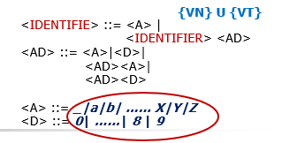
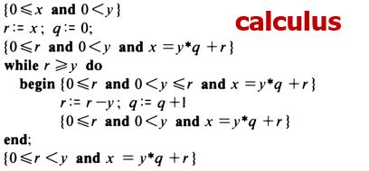
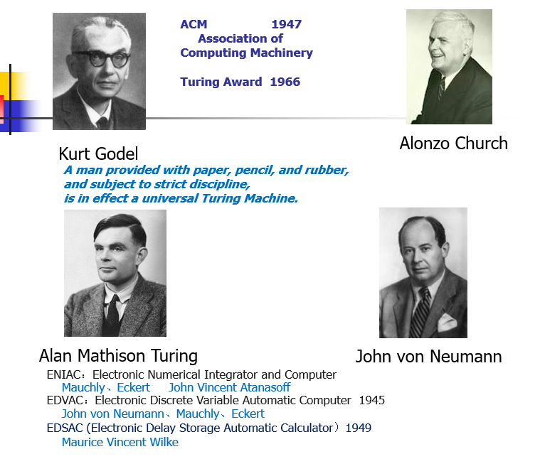
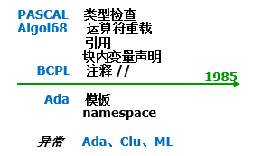
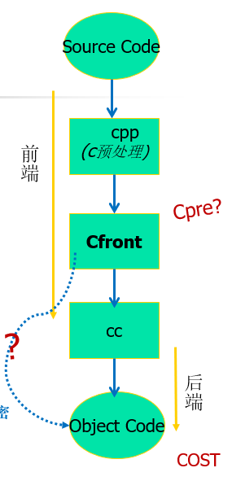

C++高级程序设计
---
1. C++广泛应用于很多的领域，使用C++我们计算出来很多的工具

<!-- TOC -->

- [1. 语言](#1-语言)
  - [1.1. 语言特征](#11-语言特征)
  - [1.2. Avram Noam Chomsky](#12-avram-noam-chomsky)
  - [1.3. 语义分类](#13-语义分类)
- [2. Programming](#2-programming)
  - [2.1. 对于Programming的不同看法](#21-对于programming的不同看法)
    - [2.1.1. Science 科学](#211-science-科学)
    - [2.1.2. 艺术](#212-艺术)
  - [2.2. 编程范式](#22-编程范式)
    - [2.2.1. 命令式程序编程范式](#221-命令式程序编程范式)
    - [2.2.2. 声明式编程](#222-声明式编程)
  - [2.3. C++ 发展历程](#23-c-发展历程)
    - [2.3.1. Simula I(Simula 67 前身)](#231-simula-isimula-67-前身)
    - [2.3.2. Simula 67](#232-simula-67)
    - [2.3.3. Bjarne Stroustrup designed and implemented C++](#233-bjarne-stroustrup-designed-and-implemented-c)
  - [2.4. C++的诞生](#24-c的诞生)
    - [2.4.1. 史前 1979](#241-史前-1979)
    - [2.4.2. 思考](#242-思考)
    - [2.4.3. 带类的C 1979 方言](#243-带类的c-1979-方言)
    - [2.4.4. C++ 1983](#244-c-1983)
  - [2.5. C和C++的关系](#25-c和c的关系)
  - [2.6. 程序员是应该被相信的](#26-程序员是应该被相信的)

<!-- /TOC -->

# 1. 语言

## 1.1. 语言特征
1. Syntax、Semantics、Pragmatics 句法、语义、语用
    + 语义:
        + 静态语义:Static
        + 动态语义:Dynamic semantics
        + 静态:在将程序交给操作系统之前，也就是在形成过程中的
2. EBNF/语法图:从自然语言中抽象出来的，用符号语言形式化，thank sb for sth
3. BNF范式 巴科斯范式
    + 描述编程语言的文法，自然语言存在不同程度的二义性。这种模糊、不确定的方式无法精确定义一门程序设计语言。必须设计一种准确无误地描述程序设计语言的语法结构，这种严谨、简洁、易读的形式规则描述的语言结构模型称为文法。该范式由他定义 Algol 60 语言时提出
    + ::- 是按照一定规则实现，以下的ID、A、D是非终结符，使用<>代替，而`_`是终结符
    + `<ID> ::- _<A>_<>` (ID根据以下三条规则进行生成，有四种结果)
    + `<A> ::- a|b`
    + `<D> ::- 0|1`



4. 计算机是根据给定的范式规则，不断用右部来替换左部，生成抽象语法树
    + 从下往上:reduce
    + 从上往下:reduct

## 1.2. Avram Noam Chomsky
1. 将自然语言分成四类
    + RG:自动识别模型 Finite Automata
    + CFG:自动识别模型 PushDown Automata 使用栈
    + CSG:自动识别模型 Linear Bounded Automata
    + PSG:自动识别模型 Turing Automata
    + 从上往下:约束越来越小，外延越来越大
    + 用ad hoc进行解决

2. 语法:上下文无关文法 Context free grammer
    + 也有不是上下文无关文法的

3. 在特定的字母表上，按照一定的语法形成的符号串的集合就是语言

4. 文法定义G=（V<sub>N</sub>，V<sub>T</sub>，R，Z)
    + V<sub>N</sub>非终结符号(或语法实体，或变量)集
    + V<sub>T</sub>终结符号集
    + R 规则集合
    + Z 目标

## 1.3. 语义分类
1. 操作语义
2. 指称语义
3. 公理语义

# 2. Programming

## 2.1. 对于Programming的不同看法

### 2.1.1. Science 科学


1. The Science of programming —— David Gries
    + 程序一般会有前置条件和后置条件，在写程序之前要先写好前后置条件
    + 上图中从左到右的为不断修正程序的bug
    + 最后x的输入条件是从结果 x = y * q + r 推知
2. 应该的程序形式:calculus,在每一句前后都有条件(检查)



3. 另一种保证程序正确性方法:
    + 使用之前提到的自动机进行模型验证

### 2.1.2. 艺术
1. The Art of Computer Programming —— Donald Ervin Knuth(推荐阅读)
2. 为数字计算机准备程序的过程特别吸引人，不仅因为它可以带来经济和科学上的回报，还因为它可以成为一种审美体验，就像作诗或作曲一样
3. 在许多情况下，除非人们对计算机的机器语言也有一定的了解，否则无法欣赏这种算法的全部美；相应的机器程序的效率是一个不能脱离算法本身的重要因素。

## 2.2. 编程范式

### 2.2.1. 命令式程序编程范式
1. 过程式程序设计
    + 基于过程调用的概念
    + 分析出解决问题所需要的步骤，然后用函数把这些步骤一步一步实现，使用的时候一个一个依次调用就可以了（命令式思想：即程序员一步步告诉计算机应该做什么)
2. 面向对象式程序设计
    + 人类与现实世界现象相互作用的概念理论和模型
    + 把构成问题事务分解成各个对象，建立对象的目的不是为了完成一个步骤，而是为了描叙某个事物在整个解决问题的步骤中的行为



1. 做不到所有问题都可以用完备系统进行计算的
2. 可计算性:问题
    + 可递归的问题都是可计算的
    + 可以使用lambda算子可以表示的都是可计算的
    + 使用图灵机表示的都是可计算的
    + 后来证明的上述三个问题是同一个问题
    + 之后冯诺依曼体系结构解决了计算问题

### 2.2.2. 声明式编程
1. 函数式设计编程  Haskell、R
    + 数学与函数论
    + Lisp(atom, list，cons,…) app：Emacs
    + 函数副作用:函数作用过程中，会修改外部的部分环境参数，比如fg(x)!=gf(x)
    + Letax也是这种
    + Hadoop:Map Reduce 分布式计算:就是把相互独立、无先后序关系的事情并行计算
    + <a href = "https://blog.csdn.net/archimelan/article/details/81940858">什么是函数式编程</a>
2. 逻辑式程序设计
    + 人工智能中的自动证明
    + 基于公理，推理规则和查询
    + 序言
    + 将人类的知识告诉给机器，然后让机器自己决定计算结果（AI的第二阶段)

```
son(a,c)
son(b,c)
brother(X,Y) -son(X,Z),son(Y,Z) 规则
?-brother(a,b) # 询问机器
Yes            # 机器回答
?-brother(a,X) # 询问机器
unknown        # 机器回答
```
1. 无法了解其中具体的运行状况

## 2.3. C++ 发展历程


1. 目的:更告诉地进行编码
2. John Backus:发明了FORTRAN，使得编程更贴近于问题本身
3. Dijkstra:发明了编译器，著名观点:goto是有害的，不能随意跳转
4. Algol 60:其中阐述了很多的一些观点
5. 脉络一:Algol 68:结构化编程的部分的继承
    + Niklaus Wirth:发明了PASCAL，很实用于教学
    + C. A. R. Hoare
    + Donald E.Knuth:和 Dijkstra一同提出goto有害性
    + 继承下来:关于结构化编程的特性
6. 脉络二:系统化编程的继承
    + BCPL:贴近计算机，写出高效的程序，很好的想法:将IO作为类成分而不是语言成分，以提高语言可移植性
    + 在BCPL和C之间还有B语言，B语言是将BCPL里面的比较繁杂的部分取出。
    + C:Dennis Ritchie、Ken Thompson，compiler决定程序语义和性质
    + 继承下来:关于系统编程的特性
7. 脉络三:Simula 67 第一个OO的研究(OO部分的继承)
    + OO的第一个提出人:Ole-Johan Dahl、Kristen Nygaard
    + 继承下来:关于面向对象编程的特性
    + Barbara Liskov:关于高层复用做出很大的贡献
8. C++为什么不叫D:因为并没有完全抛弃C中的很多东西，粗略说法

### 2.3.1. Simula I(Simula 67 前身)
1. 背景:1962, Kristen Nygaard(KN), initiated a project
    + 模拟语言:仿真，用户模拟某些不能真实做的、已有较大随机性的实验
    + UNIVAC
2. 选择:FORTRAN or ALGOL60(已经有一些局部性概念了)?
    + 块状结构
    + 良好的编程安全性
    + 欧洲爱国主义
3. 入手:仿真语言突破严格的后进先出机制
4. 措施:
    1. 类似活动声明的过程
    2. 用于动态命名和引用的显式进程指针
    3. 访问机制
    4. 进程的调度和排序机制
5. 实现:
    + 编写新的运行时系统(垃圾收集器)
    + compiler extensions：block prex" SIMULA"，兼容Algol60 编译器扩展:
6. 还不是编程语言

### 2.3.2. Simula 67
1. 思考:公共部分抽象形成class和subclass
    + 活动/过程:通常用于编程和系统设计 
    + 属于具有公共属性的不同类的对象 
    + Tony Hoare提出了类和子类的概念
2. 方法:
    + 类：假设运算符是为整个语言定义的基本协同程序调用 
    + 继承
3. 更多的细节
    + 自下而上程序设计
    + 从"虚拟程序"的概念看自上而下的机制
    + Tony Hoare :"abstraction function"
    + 垃圾收集器
4. OO paradigm:基本已经形成了OO的全部概念
5. 缺点:为什么simula 没有向下发展
    + runtime有很大问题，运行慢
    + 使用人很少，主要在欧洲而不再工业中心美国
    + 具有不可重用性的问题

### 2.3.3. Bjarne Stroustrup designed and implemented C++
1. C++的发明人
2. BS为了完成博士论文需要一门语言作为支撑
   1. Simula：性能差
   2. BCPL：debug困难
   3. 虽然他最后还是选择原有语言完成了论文，但是希望能有一门语言综合simula的良好编程体验和BCPL高性能的特点。

## 2.4. C++的诞生

### 2.4.1. 史前 1979
1. 最早是为了研究分布式系统的系统软件组织:Cambridge ph.D
    + 设计：隔离良好的模块组合为软件
    + 实验：模拟器 IBM/360
2. 实现
    1. Simula:第一阶段
        + 优点:良好组合特征、良好的可读性、co-routine、灵活类型系统、编译捕捉错误能力强
        + 缺点：性能差，确实是很差的
        + 原因：运行时的类型检查、废料收集
    2. BCPL:第二阶段，问题debug难

### 2.4.2. 思考
1. 科学观
    1. 设计：程序组织 Simula
    2. 效率：连接规则简单、灵活（异构语言) BCPL
    3. 移植性：不能依赖复杂的运行系统
    4. 其他
        + protected、const、区分初始化和赋值、异常(源于OS)
        + int x = 8;是初始化
        + x = 8是赋值
2. 哲学观、历史观		
    + 实用主义
3. 文学观
    + 存在主义
    + 幽默感

### 2.4.3. 带类的C 1979 方言
1. UNIX 内核分布到局域网 Bell Lab
    + 内核模块化
    + 流量分析
2. 本质(接近机器，接近问题)
    + 组织 class
    + 计算 C
    + 舍弃并行，走向通用
    + 舍弃复数、矩阵、字符串等
3. 工具
    + C-pre: C(某些语言结构不安全，灵活、高校、可用、可移植) + class
    + 16 projects  	1980
    + lib + job system
4. 不能舍弃C中"危险" 、"丑陋"特性而付出效益的代价
5. Linker 连接兼容性 重于 代码兼容性
    + 分别编译 编译一致性保障，头文件
    + 类型安全
    + 方便与其他语言实现的模块连接，不能附加DB（如：散列)
6. 稳步前进
    + 实现+测试 非论文式
    + 自我应用
    + 逐步推广
7. 出发点:**程序员是可以被相信的**
    + 这就是为什么C++中存在很多很灵活并且看似不合理的地方
8. 在贝尔实验室，C++的思想逐渐，完善，C++思想逐渐完善，C-pre:预处理程序，C + class of Simula



### 2.4.4. C++ 1983
1. C++ 1983
    + 影响语言设计的因素
        + 用户 产业界+大学
        + 运行环境 硬件+OS
    + 避免提供工具
    + Cfront
2. 标准化
    + ANSI 1994
    + ISO 1998
3. 观点
    1. 好的语言不是设计，而是成长起来的
    2. 相比数学，与工程、社会学、哲学的关系更紧密
    3. 亲历实验，依赖老练的程序员
    4. 正交性要让位于有用性和效率
4. C front就已经生成了所有的语义
5. C的编译过程：C++源代码想通过cpp预处理后再通过Cfront翻译成C语言，最后通过C编译器来使程序运行。
6. 用Cfront不用Cpre的原因：Cpre不懂C语法，Cfront懂，发现语法错误会传回source code，但Cpre将方言部分翻译成c后交给cc，此时若发现错误才传回source code
7. 正交性：矛盾体，有你没我，有我没你。但这些可以容忍，如果共存后效率能提高

名词|全称|功能|备注
--|--|--|--
cpre|-|将C++扩展内容翻译成为c|是C With Class中的含有的
cfront|-|将c++翻译成为c,可以直接检查语法错误，而不必经过cc|编译简单分成前端后端，前端负责语法检查，后端负责代码生成和优化，cc负责后端
cc|c compiler|c编译器，负责进行语法检查，有问题返回Source code|-
cpp|c pre process|-|-



## 2.5. C和C++的关系
1. 超集
2. C++ 支持 C 所支持的全部编程技巧
3. 任何 C 程序都能被 C++ 用基本相同的方法编写，并具备同等开销（时间、空间)
4. C++ 兼顾细节与抽象

## 2.6. 程序员是应该被相信的
1. 与可能出现的错误相比，更重要的是能做什么好的事情