C++
---
1. C++ 是 C 的超集，很多的C中的库都比C++兼容了

<!-- TOC -->

- [1. C++基本语法](#1-c基本语法)
  - [1.1. 分号&语法块](#11-分号语法块)
- [2. 最简单的C++程序](#2-最简单的c程序)
- [3. 程序语句](#3-程序语句)
  - [3.1. 顺序结构](#31-顺序结构)
  - [3.2. 条件结构](#32-条件结构)
    - [3.2.1. switch的实现与优化(表驱动)](#321-switch的实现与优化表驱动)
    - [3.2.2. 思考一:运行中的很多过程是无法进行断点调试的，只能进行输出分析](#322-思考一运行中的很多过程是无法进行断点调试的只能进行输出分析)
    - [3.2.3. 插件的思考](#323-插件的思考)
    - [3.2.4. 再进一步调整:避免硬编码，使用外部文件](#324-再进一步调整避免硬编码使用外部文件)
    - [3.2.5. switch的实现与优化(编译过程)](#325-switch的实现与优化编译过程)
    - [3.2.6. 表驱动的应用](#326-表驱动的应用)
  - [3.3. 循环结构](#33-循环结构)
- [4. 面向对象编程十大问题](#4-面向对象编程十大问题)
- [5. VS 2017 以及插件使用注意](#5-vs-2017-以及插件使用注意)
  - [5.1. 插件使用](#51-插件使用)
  - [5.2. 考试/练习](#52-考试练习)
  - [5.3. 调试](#53-调试)
  - [5.4. 多个项目](#54-多个项目)
  - [5.5. 测试](#55-测试)
  - [5.6. Upload](#56-upload)
  - [5.7. 如何停留调试框](#57-如何停留调试框)
  - [5.8. 常见问题](#58-常见问题)
    - [5.8.1. 插件错误](#581-插件错误)
    - [5.8.2. 您未参加考试](#582-您未参加考试)
    - [5.8.3. 项目不存在](#583-项目不存在)
    - [5.8.4. 未生成可执行文件](#584-未生成可执行文件)
    - [5.8.5. 找不到窗口](#585-找不到窗口)
    - [5.8.6. 其他问题](#586-其他问题)
  - [5.9. 下载用例](#59-下载用例)
  - [5.10. debug技巧](#510-debug技巧)

<!-- /TOC -->

# 1. C++基本语法
1. 对象:对象具有状态和行为。
2. 类:类可以定义为描述对象行为/状态的模板/蓝图。
3. 方法:从基本上说，一个方法表示一种行为。
4. 即时变量:每个对象都有其独特的即时变量。

## 1.1. 分号&语法块
1. 分号是语句结束符：一个分号表明一个逻辑实体的结束。
2. 语法块是一组用大括号括起来的逻辑连接的语句。

# 2. 最简单的C++程序
```C++
#include <iostream>
using namespace std;
int main(){
    cout<<"This is a program";
    cin>>a;
}
```
1. 包含头文件io流，同时使用c++的命名空间std

# 3. 程序语句
1. 程序语句包含表达式语句、IO语句和控制流语句
2. 控制流语句:
    + 初始化、终止、改变
    + 包含顺序、选择、重复语句

## 3.1. 顺序结构

## 3.2. 条件结构
1. if-else
2. if-else嵌套
3. switch：**break**(enum 枚举类型)
    1. 整形常量表达式:`5、const、enum、define`(对于compiler是固定的)
    2. 值不重复
    3. 次序任意(特指case)
    4. switch可以和enum结合使用，将具体数值解耦
    5. switch的进一步进一步优化可以尝试使用打表的方法
4. 表达式1?表达式2:表达式3

### 3.2.1. switch的实现与优化(表驱动)
1. 对于switch的汇编格式，其只需要被翻译为cmp一次即可。
2. switch：使用表驱动来提高效率
3. 详见PPT 36页的动画:不要将提示语进行硬编码，可以使用枚举类型(集中管理)
4. 计算机中的所有的鼠标操作都会对应一个事件
5. 字面常量调整为枚举类型，还可以使用事件表来完成
    + 使用一个handler
    + 表是从内存中装载进来
6. 目前操作系统中的对应存储对应的文件为RC

### 3.2.2. 思考一:运行中的很多过程是无法进行断点调试的，只能进行输出分析
1. 有很多的debug是无法使用断点进行调试，只能写成输出进行分析，我们不推荐字符串硬编码的方式进行编码，我们推荐使用集中管理

### 3.2.3. 插件的思考
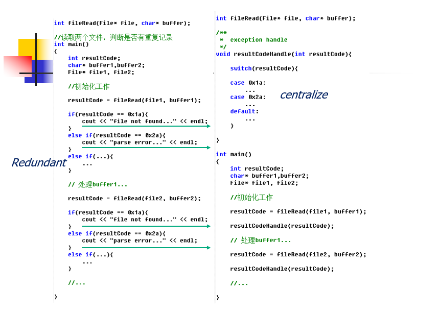

1. 这个插件的目的是收集你的操作信息等，为每一个操作，给定一个time
2. 以下是使用硬编码形式实现的插件，但是不好的，低耦合性

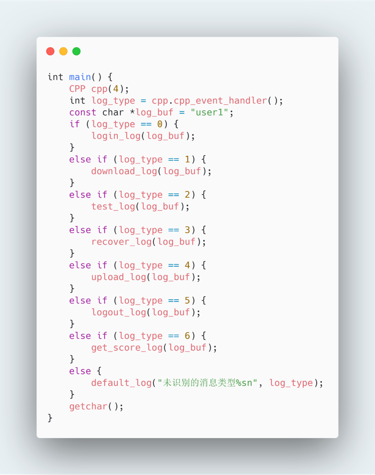
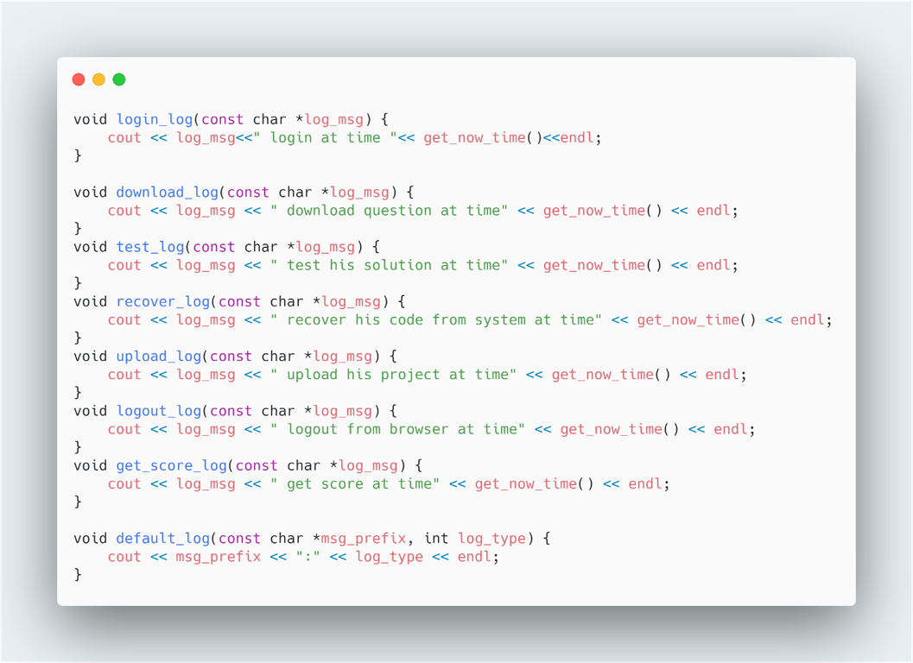
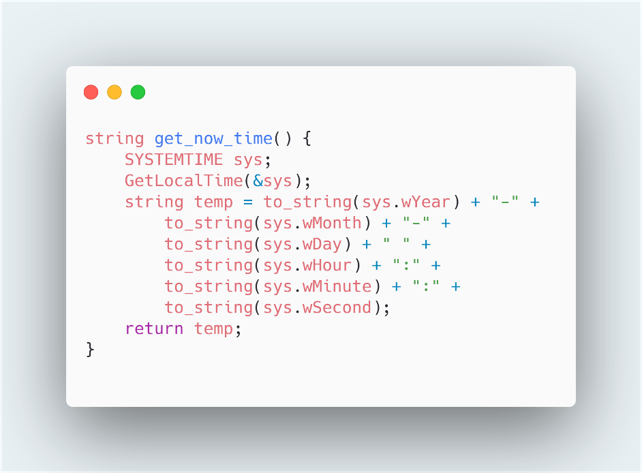

3. 第一步的修正:if-else修正为switch

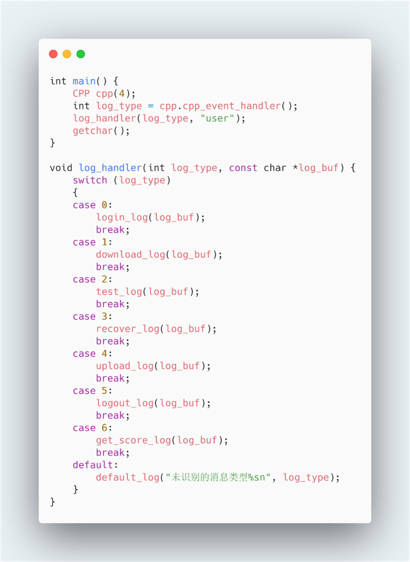

4. 结合 case 和 枚举常量的优化

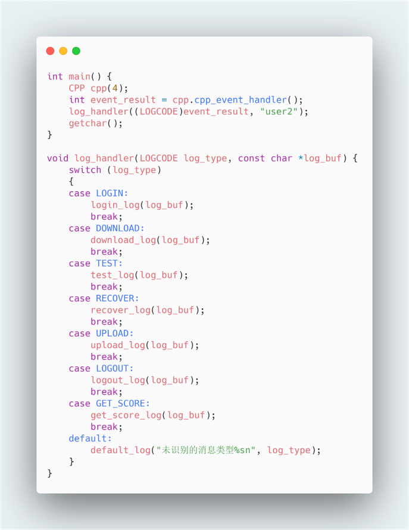
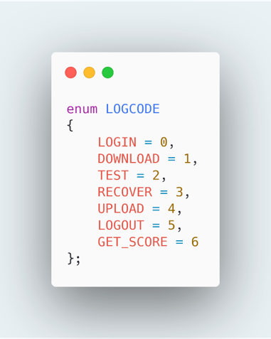

5. 进一步我们使用 表驱动 的方式来实现。

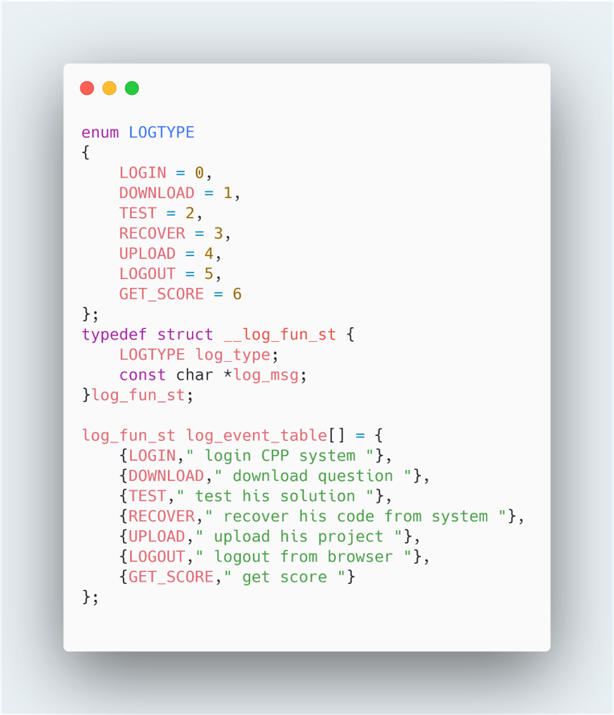
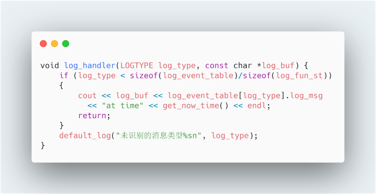

### 3.2.4. 再进一步调整:避免硬编码，使用外部文件
1. 我们从外部导入，从磁盘读入内存
2. 这样子修改外部存储文件，则可以实现汉化等修改

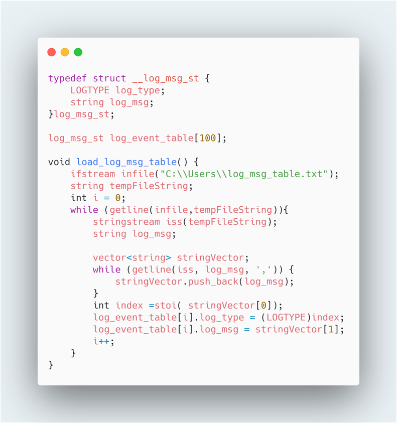
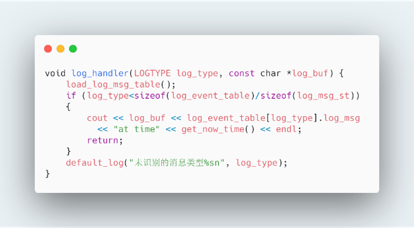

3. 这样做法也是很多的框架在做的事情，比如微软，则将窗口、菜单等字符串写到RC中，可以通过特殊的编辑器，进行修改。(I18N 国际化)

### 3.2.5. switch的实现与优化(编译过程)
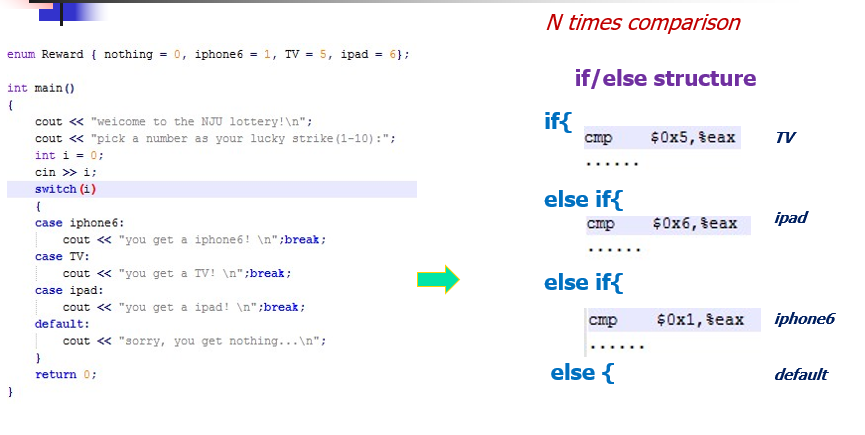
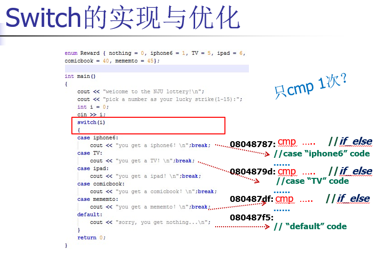

1. 08048787:是指内存代码段的位置
2. 上面还都是多段比较
3. 进行优化：为了只做一次Compare，我们直接创建了一个全新的索引表。
    + 看最上面：先和2d:default进行比较
    + 其他情况:计算offset(base,index,width)值:base + index * width + offset
    + 方法叫做:表驱动(其中的index就是枚举类的case的取值0，1等等)
    + 平衡时间和空间代价
    + 浪费空间的问题是由compiler解决的

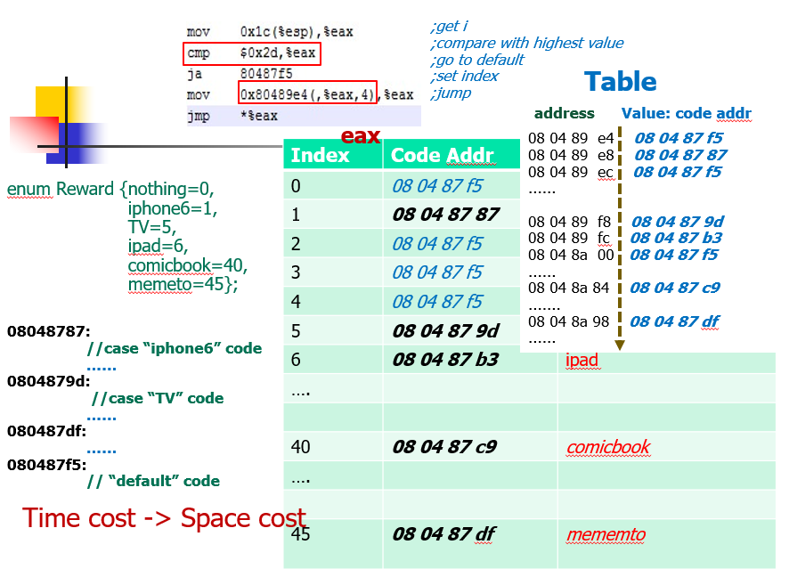

### 3.2.6. 表驱动的应用
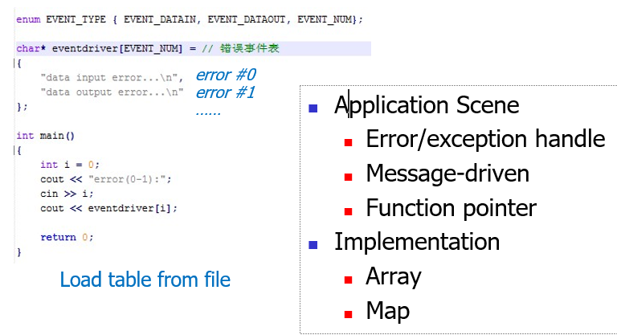

1. Application Scene应用
    + Error/exception handle 异常处理
    + Message-driven 信息驱动
    + Function pointer 函数指针:就是例子中case里面只是简答的打印，而实际情况中可能只是相似的接口而已，这是我们就要使用到函数指针了。
2. Implementation 实现
    + Array 数组
    + Map Map
3. 实际上，异常处理并不是同步的
4. IDE上的对话框也是使用表驱动来实现的
    + 在使用框架的时候，我们要看好相应的原理
    + IDE在编译运行的时候也是使用了#define(预处理)
5. 很多表都是放置到外部的文件中的
6. IDE来完成一些事件处理:对话框添加名称，添加处理函数，实际上就是添加到枚举类型中和switch里面去，classwizard，类向导
7. framework：一般会写明代码不可编辑，是IDE帮助你生成的代码，所以如果不了解框架，则会导致debug非常困难。
8. C++中的实现:宏来完成实现，使用编译预处理。
9. 参考：《代码大全》（第2版)中文版，第18章 表驱动法。

## 3.3. 循环结构
1. while循环
2. do-while循环
3. for循环
4. break跳出循环
5. continue过循环

# 4. 面向对象编程十大问题
1. 当类中未自主定义构造函数，compiler会提供默认构造函数，为什么，编译器会提供一个空类吗？编译器只有在一定**需要**默认构造函数的时候，才去创建构造函数
2. When构造函数、析构函数被定义为private？友元、static成员的使用，When？
    1. private的构造函数和析构函数常常用在某些设计模式下的情况
    2. 使用方法:通过友元类对象的方法来完成创建、使用static方法完成创建
    3. 构造函数的私有化的类的设计保证了其他类不能从这个类派生或者创建类的实例(单件模式)
    4. <a href = "https://blog.csdn.net/vivian187/article/details/93043070">参考</a>
3. 为什么引入成员初始化表？为什么初始化表执行次序只与类数据成员的定义次序相关？
    + 初始化列表中初始化的顺序与声明的顺序一致，与自己的声明顺序无关
    + 原则上的初始化顺序:**就地初始化 > 构造函数的初始化列表 >构造函数里的赋值(严格意义上不能成为初始化)**
    + <a href = "https://blog.csdn.net/qq_38243831/article/details/97814248">参考</a>
```c++
class CString{
    char *p;
    int size;
    public:
        CString(int x):size(x),p(new char[size]) {}    
    };
```
4. 为什么引入Copy构造函数、=操作符重载？
    1. copy()拷贝函数:相同类型的类对象是通过拷贝构造函数来完成整个复制过程的，拷贝函数的拷贝过程没有处理静态数据成员，详见下
5. What is Late Binding? How C++ implement vitural ？
6. When we use virtual ？
```c++
class Shape {
    public:
        virtual void draw() const = 0;
        virtual void error(const string& msg);
        int objectID() const;
};
```
7. What public继承和non-public继承means？
    1. public继承方式
        + 基类中所有public成员在派生类中为public属性；
        + 基类中所有protected成员在派生类中为protected属性；
        + 基类中所有private成员在派生类中不可访问。
    2. protected继承方式
        + 基类中的所有public成员在派生类中为protected属性；
        + 基类中的所有protected成员在派生类中为protected属性；
        + 基类中的所有private成员在派生类中仍然不可访问。
    3. private继承方式
        + 基类中的所有public成员在派生类中均为private属性；
        + 基类中的所有protected成员在派生类中均为private属性；
        + 基类中的所有private成员在派生类中均不可访问。
    4. 参考<a href = "https://blog.csdn.net/baowxz/article/details/51282395">公有、非公用继承的区别</a>
8. Why` =  ()  []  -> `不能作为全局函数重载?
    + 大体上来讲，C++一个类本身对这几个运算符就已经有了相应的解释了。
    + 如果将这四种符号进行友元全局重载，则会出现一些冲突
    + <a href = "https://blog.csdn.net/weixin_30781107/article/details/98147938">参考</a>
9. When成员函数能返回& ？
10. When and How to 重载new、delete？
    + 不允许重载:`void* operator new(size_t, void*); // 不允许重新定义这个版本`
    + <a href = "https://blog.csdn.net/fengbingchun/article/details/78991749">C++中重载new和delete的使用</a>

# 5. VS 2017 以及插件使用注意
1. 确保时间正确
2. 实验实例:是开发环境，而不是工作版本。
    + 实验实例:在上面有
3. 更新:直接点击安装就可以
4. CppMinitor显示提高性能，永不再显示，或者点×

## 5.1. 插件使用
1. 时间是精确到秒的，尽量提前完成作业。
2. 下载作业:选择作业
3. 存储路径:一定是空文件夹，最好是在桌面上新建空白文件夹。
4. 可以选择已经进行下载，直接进入考试
5. 只要上传过，我们就可以下载上次提交的代码
    + 登录，download
6. 一定要先进入考试，前两个按钮，

## 5.2. 考试/练习
1. 文件 -> 新建 -> 项目，然后找到Visual C++,然后选择空项目，然后在下方名称中输入考试题目文件夹中考试题目文件夹的名字(比如Q2)，点击确认
2. project的命名:根据对应文件来进行生成的
3. 项目新建后，我们在源文件中，右键，添加新建项，新建C++文件，命名为一个英文文件。
4. 如果有Q28，Q29，Q30三道题目(可以放到一个解决方案中)，在解决方案中选择添加，然后新建项目，然后按照题目名字新建就行
    + 之后可以一起上传一起下载。
5. VS2017，编程完成后，我们点击菜单栏:生成 ->重新生成解决方案进行项目的编译，然后点击菜单的"调试"进行调试，考试的debug模式一定要选择x86模式。
6. 在某一行打上断点就可以在对应位置停下来。

## 5.3. 调试
1. 禁用断点:划到断点会有弹出框。
2. 点继续就会向下跳转
3. 在终止红色框旁边，会有断点控制
    + 分别是下一步(向下箭头)
    + 进入函数调试
    + 跳出函数，停止单步
4. 会显示局部变量
    + 监视:可以直接输入进行监视具体的值

## 5.4. 多个项目
1. 只需要调试一个项目，调整Q28->Q29，则选择Q29然后进行右键，然后进行设为启动项目/重新生成。
2. 加粗是表示为启动项目

## 5.5. 测试
1. 首先进行**重新生成解决方案**，首先是X86
2. 然后在选择Test，然后可以选择对应题目的Run，然后就，开始进行运行，获得结果，AC:通过，WA:错误，TIE:超时，不会告诉你的错误的测试。

## 5.6. Upload
1. 进行上传。会提示上传成功
2. 不upload则会没有分数。

## 5.7. 如何停留调试框
1. system("pause");来进行停留了吗

## 5.8. 常见问题

### 5.8.1. 插件错误
1. 与服务器建立连接出错，请重试
2. 检查CPP网站是否正常，如果网站没事，就是自身网络问题。
3. p.nju.edu.cn可以进行检查。

### 5.8.2. 您未参加考试
1. 去cpp plugin download，要么下载要么直接进入

### 5.8.3. 项目不存在
1. 项目名错误:右键重命名进行生成即可

### 5.8.4. 未生成可执行文件
1. 可能X86变为X64，修正然后重新生成即可。

### 5.8.5. 找不到窗口
1. 可以在窗口中重置窗口布局

### 5.8.6. 其他问题
1. 可以发邮件给助教邮箱

## 5.9. 下载用例
1. 使用输入输出重定向来完成。

## 5.10. debug技巧
1. 简单断点
2. 可以选择设置(小齿轮):再设置条件，设置条件断点。
3. Ctrl + K + Ctrl + C 加注释
4. Ctrl + K + Ctrl + U 取除注释