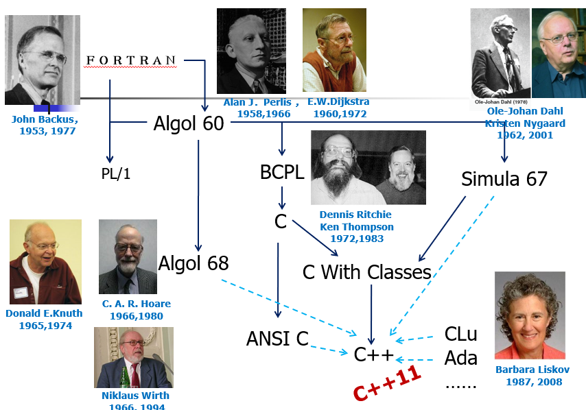
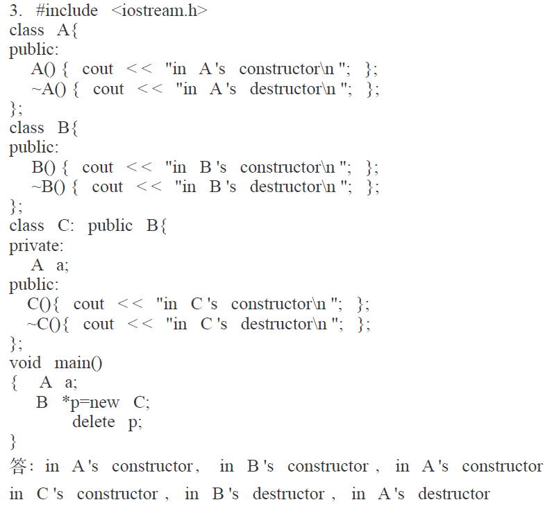
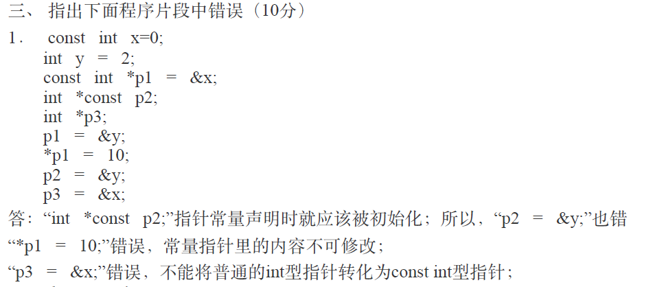
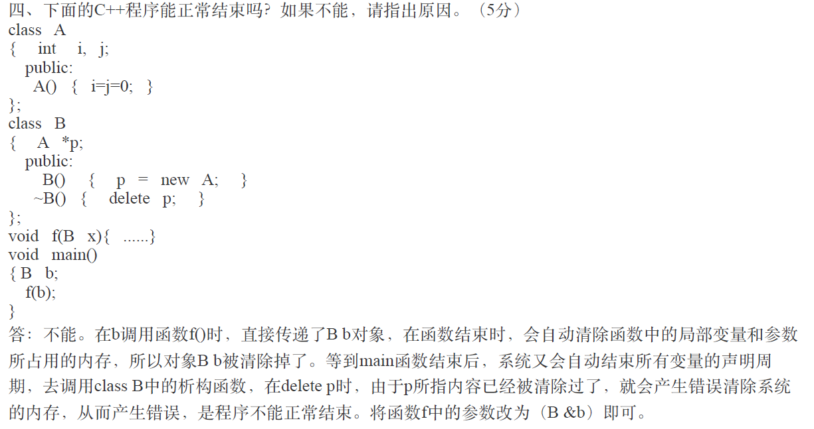
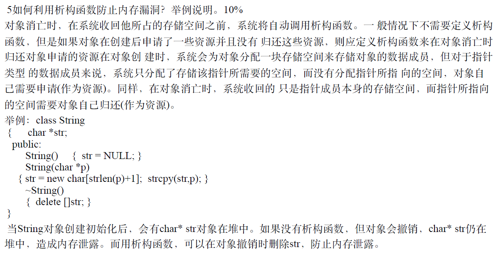
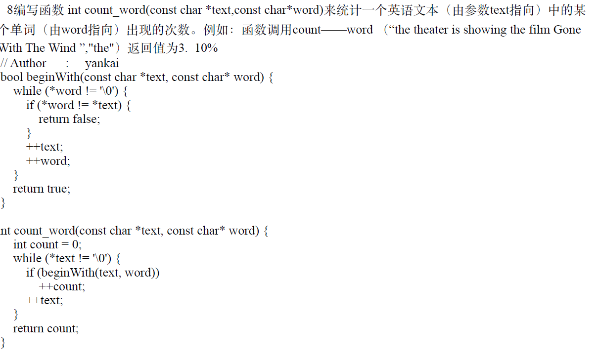

exam-final
---

<!-- TOC -->

- [1. C++ 概念](#1-c-概念)
  - [1.1. C++ 设计理念](#11-c-设计理念)
  - [1.2. C++历史](#12-c历史)
  - [1.3. C与C++的关系](#13-c与c的关系)
  - [1.4. C和C++混合编程应该注意的问题](#14-c和c混合编程应该注意的问题)
- [2. C++编译器为空类提供的部分(比如class Empty{})](#2-c编译器为空类提供的部分比如class-empty)
- [3. 试卷：2014年](#3-试卷2014年)
  - [3.1. 影响表达式因素](#31-影响表达式因素)
  - [3.2. 看代码题目](#32-看代码题目)
  - [3.3. 观察者题目](#33-观察者题目)
- [4. 试卷：2003年](#4-试卷2003年)
  - [4.1. 面向对象程序设计的主要特点](#41-面向对象程序设计的主要特点)
  - [4.2. 静态绑定和动态绑定](#42-静态绑定和动态绑定)
  - [4.3. C++重用代码](#43-c重用代码)
  - [4.4. C++结构化程序设计的基本控制结构](#44-c结构化程序设计的基本控制结构)
  - [4.5. 什么是ADT？](#45-什么是adt)
  - [4.6. 审题题目](#46-审题题目)
  - [4.7. 异常结束](#47-异常结束)
- [5. 试卷:2008年](#5-试卷2008年)
  - [5.1. 多态含义](#51-多态含义)
  - [5.2. 多态的表现形式](#52-多态的表现形式)
  - [5.3. 引用](#53-引用)
  - [5.4. 析构函数避免内存泄漏](#54-析构函数避免内存泄漏)
  - [5.5. 依据什么原则声明成员函数为纯虚函数/虚函数/非虚函数？](#55-依据什么原则声明成员函数为纯虚函数虚函数非虚函数)
  - [5.6. 最有价值的C++规则](#56-最有价值的c规则)
  - [5.7. 引用类型与指针类型相比的优点](#57-引用类型与指针类型相比的优点)
  - [5.8. 代码题目](#58-代码题目)
- [6. 试卷](#6-试卷)
  - [6.1. inline函数的作用？随意使用可能导致的问题](#61-inline函数的作用随意使用可能导致的问题)
  - [6.2. const的几种用法](#62-const的几种用法)
  - [6.3. 为什么使用构造函数机制？](#63-为什么使用构造函数机制)
  - [6.4. 单件模式](#64-单件模式)
  - [6.5. 智能指针用法](#65-智能指针用法)
- [7. C++ 11](#7-c-11)
- [8. 虚函数调用顺序](#8-虚函数调用顺序)
- [9. 默认参数问题](#9-默认参数问题)
- [10. 补充程序题](#10-补充程序题)
- [11. 简答题补充](#11-简答题补充)

<!-- /TOC -->

# 1. C++ 概念

## 1.1. C++ 设计理念
1. 效率
2. 实用性优于艺术性严谨性
3. 相信程序员允许一个有用的特征比防止各种错误使用更重要(相信程序员)

## 1.2. C++历史


| 人                           | 成就           | 备注     |
| ---------------------------- | -------------- | -------- |
| Kristen Nygaard              | Simula67       | 创建     |
| Ole-Johan Dahl               | OO 编程        | 创建     |
| Dennis Ritchie、Ken Thompson | C语言          | 创建     |
| Bjarne Stroustrup            | C with Classes | 1980形成，并最终发明C++ |
| Rick Mascitti                | C++            | 1983正式命名 |
| Dijkstr                      | 结构化编程     | 创建     |

## 1.3. C与C++的关系
1. (代码层面)C++完全包含了C语言成分，支持C支持的全部编程技巧，C是建立C++的基础，同时C++还添加了OOP的完全支持。
2. (运行)任何C程序都能被C++用基本相同的方法编写，并具有相同的运行效率和空间。
3. (功能)C++还引入了重载、内联函数、异常处理等功能，对C中过程化控制及其功能并扩充。

## 1.4. C和C++混合编程应该注意的问题
1. 名变换:如果调用C语言库中的函数，则需要附加"extern C",限制C++编译器进行名变换，便于可以连接。
2. 静态初始化:C++静态的类对象和定义在全局的、命名空间中的或文件体中的类对象的构造函数通常在 main 被执行前就被调⽤，只要可能，⽤ C++写 main()，即使要⽤ C 写 Main 也⽤ C++写
3. 内存动态分配:new/delete 调⽤ C++的函数库，malloc/free 调⽤ C 的函数 库，⼆者要匹配，防⽌内存泄露;
4. 数据结构兼容:将在两种语⾔间传递的东西限制在⽤ C 编译的数据结构的范 围内;这些结构的 C++版本可以包含⾮虚成员函数，不能有虚函数。
5. 因为C++是C的超集，且C是结构化编程语⾔，⽽C++⽀持⾯向对象编程语⾔，所以在混合编程时，不应当出现class等⾯向对象的关键字
6. C语⾔不支持函数重载。在C++中f (int, int) 与 f(int, double) 是不同的函数，都重载了函数f()；但是在C语⾔中却被认为是相同的函数。因为在编译时，C语⾔给这⼏个函数的命名为f_；⽽C++命名分别为f_int_int, f_int_double, f_，以表⽰区别；所以混合编程时应注意重载函数的问题；
7. 在c++中也允许在结构和联合中定义函数，他们也具有类的基本功能，与CLASS所不同的是：结构和联合的成员的默认访问控制为PUBLIC.

# 2. C++编译器为空类提供的部分(比如class Empty{})
```c++
class Empty{
    public:
        Empty();
        Empty(const Empty&);
        ~Empty();
        Empty &operator=(const Empty&);
        Empty *operator&();
        const Empty *operator&() const;
}
```
- 操作符重载返回值是`*`的有:new、delete、&、->

# 3. 试卷：2014年

## 3.1. 影响表达式因素
1. 操作数、操作符和标点符号组成序列，表示一个计算过程。
2. 优先级、结合性、求值次序、类型转换和操作符的副作用。

## 3.2. 看代码题目
1. 指针移动和Delete操作
2. 返回局部变量，外部使用会导致内存泄漏(被释放了)
3. 从父类指针调用，即便子类修改了也没有影响。
4. 异常的识别机制:顺序

## 3.3. 观察者题目
1. `char name[length]`;
2. 注意`List<Observer>`使用iterator

# 4. 试卷：2003年

## 4.1. 面向对象程序设计的主要特点
>封装、继承、多态。通过消息传递来实现程序的运转

## 4.2. 静态绑定和动态绑定
1. 动态绑定：继承实现的多态，发生在运行时刻，灵活性高，效率低，后期绑定需要显式指出
2. 静态绑定：模板实现的多态，发生在编译时刻，灵活性低，效率高。

## 4.3. C++重用代码
1. 内联函数
2. 继承

## 4.4. C++结构化程序设计的基本控制结构
1. 顺序
2. 循环
3. 条件

## 4.5. 什么是ADT？
1. 抽象数据类型是指一个数据模型以及定义在此数学模型上的一组操作，需要通过固有类型来实现。

## 4.6. 审题题目
1. 审题看好情况




- const int *p 不能改值
- int *const p 不能改指向，**必须立即初始化**
- const类型的函数中不能修改类的非静态数据成员，可以修改静态数据成员
- static 初始化:`int C::y = 0`

## 4.7. 异常结束


# 5. 试卷:2008年

## 5.1. 多态含义
1. 某一论域中的一个元素可以有多种解释
2. 相同的语言结构可以对不同类型的实体进行操作
3. 一个公共的消息集可以发送到不同的对象，从而及进行不同的处理。

## 5.2. 多态的表现形式
1. 虚函数
2. 函数重载
3. 操作符重载
4. 模板
5. 继承
6. 函数指针
7. 可以分为
   1. 重载多态
   2. 强制多态
   3. 包含多态
   4. 参数多态

## 5.3. 引用
1. 引用是对一块已有内存空间的别名。
2. 作用：避免消耗资源，提高访问效率，主要用于函数参数传递和动态变量命名。
3. 用途：返回对象本身，也就是要求值改变被保留
4. 危害：如果函数返回值的类型是应用或指针类型，不应该将局部量或局部量的地址作为返回值。

## 5.4. 析构函数避免内存泄漏
1. 析构函数是在对象消亡的时候，回收其存储空间。
2. 一般不需要单独定义析构函数，但是如果对象额外申请了一些空间，则需要进行手动归还。



## 5.5. 依据什么原则声明成员函数为纯虚函数/虚函数/非虚函数？
1. 纯虚函数：只给出函数声明而没有给出函数实现的虚成员函数，只有函数接口会被继承，子类必须继承接口，提供实现代码
2. 一般虚函数：函数接口以及缺省代码都会被继承，子类必须继承函数接口，可以继承缺省代码。
3. 非虚函数：函数的接口和其实现代码都会被继承，必须同时继承代码和实现代码
4. 遵循的原则：
   1. 使用虚函数的限制
   2. 类成员函数可以是虚函数
   3. 静态成员函数、内联成员函数和构造函数不能是虚函数
   4. 析构函数往往是虚函数
   5. 不要定义与继承而来的废墟函数同名的成员函数
   6. 绝对不要重定义继承而来的缺省参数值。

## 5.6. 最有价值的C++规则
1. 尽可能地使用const修饰
2. 避免一切潜在的歧义性
3. 不要多态处理数组
4. 使得非叶类变得抽象
5. 争取异常安全的代码
6. 使用析构函数避免出现内存泄漏。

## 5.7. 引用类型与指针类型相比的优点
1. 效率高:引用是采用直接访问形式，指针采用间接访问形式。
2. 内存占用少：引用和被引用变量共享内存，而指针有自己的内存空间
3. 代码可读性好：作为函数参数类型时，引用类型参数的实参时一个变量，而指针类型变量的实参是一个变量的地址。
4. 安全：引用类型一旦定义后不能改变，而指针变量定义后可以指向其他同类型的变量
5. 大多数编译程序往往把引用类型作为指针类型来实现，对使用者透明。

## 5.8. 代码题目
1. 查找文本中单词出现的次数



2. 返回参数为引用类型，可以`return *this`

# 6. 试卷

## 6.1. inline函数的作用？随意使用可能导致的问题
1. 作用
   1. 增加程序的可读性
   2. 提高程序的运行效率
   3. 弥补宏定义不能及进行类型检查的缺陷
2. 问题：
   1. 增大目标代码， 调用时必须在调用该函数的每一个文本文件中定义
   2. 病态换页(内存抖动)
   3. 降低指令快取装置的命中率
3. 建议：
   1. 使用频率高的小代码使用内联
   2. 内联函数定义放在头文件中
   3. 复杂的结构控制、递归不能做内联函数

## 6.2. const的几种用法
1. 修饰数据类型：表明该数据类型在程序运行过程中，值不应该被改变，声明时初始化。
2. 修饰指针
   1. 常量指针：可修改指针，不可以修改值
   2. 指针常量：可修改值，不可以修改指针
   3. 常量指针常量：均不可修改，声明时初始化。
3. 修饰函数
   1. `Type f() const`:表明告知编译器不会修改常量值
   2. `Type f(const T& t)`:表明告知编译器不要修改t中的值
4. 修饰对象，往往是修饰成员变量：`class T{ const int a = 0}`,在构造函数中使用成员初始化表对常量进行初始化。

## 6.3. 为什么使用构造函数机制？
1. 成员初始化的需要
   1. 类的封装性：由于访问权限控制，类的一些属性不应该对外暴露，而是通过构造函数来实现
   2. 使用普通成员函数调用初始化，复杂且不安全
   3. 构造函数时，由系统自动调用。

## 6.4. 单件模式
```c++
class  singleton{
    protected://构造函数外部不可以使用
		singleton(){}
		singleton(const singleton &);
	public:
		static singleton *instance() {
            return  m_instance == NULL? 
			m_instance = new singleton: m_instance;
		}
		static void destroy()  { delete m_instance; m_instance = NULL; }
	private:
		static singleton *m_instance;//保存对象的指针也是static的
};
singleton *singleton::m_instance= NULL;//初始化
```

## 6.5. 智能指针用法
```c++
template <class T>
class auto_ptr{
    public:
        auto_ptr(T *p=0):ptr(p) {}
        ~auto_ptr() { delete ptr; }
        T* operator->()  const { return ptr;}
	    T& operator *()  const { return *ptr; }
    private:
        T*  ptr;
};
```

# 7. C++ 11
1. 左值表达式和右值表达式:
   1. 左值表达式:前者修改自身值，并返回自身
   2. 右值表达式:后者先创建一个临时对像，为其赋值，而后修改x的值，最后返回临时对像
   3. 非const只能绑定在左值上，const引用可以绑定给左值和右值表达式

```c++
class A{};
A getA(){
    return A();//右值
}
int main() {
    int a = 1;
    int &ra = a; //OK
    const A &ca = getA();//OK
    A &aa = getA();//ERROR，右值不能给左值引用
    A &&aa = getA();//OK，&&是声明了一个右值引用
}
```
2. 外部模板：避免不必要的实例化
```c++
//myfunc.h
template<typename T>
    void myfunc(T t){}

//test.cpp
#include "myfunc.h"
int foo(int a){
    myfunc(1);
    return 1;
}
//main.cpp
#include "myfunc.h"
//如果没有以下的模板，那么编译器会先去实例化模板，新的方式外部模板可以避免多次实例化的问题
/*Tell compiler: this instance has been
instantiated in another module!*/
extern template void myfunc<int>(int);

int main() {
    myfunc(1);
}
```

3. 常量表达式:提供了更加一般的常量表达式，允许使用用户自定义类型，但是必须在编译的时候就能确定，所以提高了运行效率
```c++
enum Flags { GOOD=0, FAIL=1, BAD=2, EOF=3 };
constexpr int operator| (Flags f1, Flags f2)  {
    return Flags(int(f1)|int(f2));
}//如果不加constexpr则结果被认为是变量不能使用在case中
void f(Flags x) {
    switch (x) {
        case BAD: /* ... */break;
        case EOF: /* ... */ break;
        case BAD|EOF: /* ... */ break;//OK，必须是简单的确认的值
        default: /* ... */ break;
    }
}
```
4. Lambda表达式
```c++
int main() {
    std::vector<int> items { 4, 3, 1, 2 };
    std::sort(items.begin(), items.end(), 
        [](int a, int b) { return a < b; } //Lambda Function
    );
}
```

| 符号      | 含义                                              |
| --------- | ------------------------------------------------- |
| []        | 一无所获                                          |
| [&]       | 通过引用捕获任何引用的变量                        |
| [=]       | 通过复制捕获任何引用的变量                        |
| [=, &foo] | 通过复制捕获任何引用的变量，但通过引用捕获变量foo |
| [bar]     | 通过复制来获取bar； 不要复制其他任何东西          |

5. 委托构造函数:一个委托构造函数使用它所属类的其他构造函数执行它自己的初始化过程，或者说他把自己的一些（或全部)职责委托给了**其他构造函数**。
```c++
#define MAX 256
class X {
    int a;
    void validate(int x) { if (0<x && x<=MAX) a=x; else throw bad_X(x); }
public:
    X(int x) { validate(x); }
    X() { validate(42); }
    // ...
};
class X {
    int a;
public:
    X(int x) { if (0<x && x<=max) a=x; else throw bad_X(x); }
    X() :X(42) { }
    // ...
};
X(int x = 42) ?
```
6. 统一初始化
```c++
class A{
    int x, y, z;
    //Default generated by compiler
    A(initializer_list<int> list) {
        auto it = list.begin();
        x = *it++;
        y = *it++;
        z = *it;
    }
};
//Uniform Initialization achieved!
int arr[] = {1, 2, 3};
vector<int> vec = {1, 2, 3};
A  a = {1, 2, 3};
```

7. nullptr
```c++
void f(int);//f(0)
void f(char*);

f(0);         	// call f(int)
f(nullptr);   	// call f(char*)

f(NULL);// call f(int)
```

# 8. 虚函数调用顺序
```c++
class A{
    public:
	    A() { f();}
	    virtual void f();
	    void g();
		void h(){
            f();
            g();
        }
};
class B: public A
{   public:
	    void f();
	    void g();
};	
//直到构造函数返回之后，对象方可正常使用
//函数调用顺序，重要考试题，依据虚函数表
B b;      // A::A()，A::f, B::B(),为什么调用A的f而不是B的？因为名空间以及B没有构造。 
A *p= &b;
p->f();   //B::f，虚函数
p->g();   //A::g，g是静态绑定
p->h();   //A::h, B::f, A::g

class A{
    public:
        virtual void f() ;
        void g() ;
};
class B: public A{
    public:
        void f(B* const this) { g(); }//this g() this->g();
        void g() ;
};
B b;
A* p = &b;
p->f();//B::f,b.B::g
```
- 明确名空间非常重要
- h()函数是非虚接口
  - 有不同的实现:调用了虚函数和非虚函数
  - 可以替换部分的实现
  - 可以使得非虚函数具有虚函数的特性(让全局函数具有多态:将全局函数做成非虚接口)

# 9. 默认参数问题
```c++
class C {
public:
	virtual void f(int x = 0) = 0;
	void g() { cout << "wu" << endl; }
};

class D : public C {
public:
	virtual void f(int x = 1) {
		cout << x << endl;
	}
};
int main() {
	C *p_a;
	D *p_b;
	D b;
	p_a = &b;
	p_b = &b;
	p_a->f();//0
	p_b->f();//1
	p_a->g();//wu
}
```

# 10. 补充程序题
1. `A a,b(5,8);`:a调用默认构造函数，b调用(int,int)的构造函数
2. `C b(a)`:拷贝构造函数
3. 返回局部变量会错误，但是返回指针不会
```c++
char* GetString1(){
    char p[] = "Hello World";
    return p;
}
char* GetString2(){
    char *p = "Hello World";
    return p;
}
void main(){
    cout<<"GetString1 returns:"<< GetString1()<<endl;//乱码
    cout<<"GetString2 returns:"<< GetString2()<<endl;//Hello World
}
```
4. 注意不同变量类型的默认初始化值

```c++
void main(){
    char str1[] = "abc";
    char str2[] = "abc";
    const char str3[] = "abc";
    const char str4[] = "abc";
    const char *str5 = "abc";
    const char *str6 = "abc";
    char *str7 = "abc";
    char *str8 = "abc";
    cout << ( str1 == str2 ) << endl;//0
    cout << ( str3 == str4 ) << endl;//0
    cout << ( str5 == str6 ) << endl;//1
    cout << ( str7 == str8 ) << endl;//1
    //str1-4是数组指针，指向对应位置，指针则指向同一位置
}
```

5. 默认偏移了一个数组大小
```c++
void main(){
    int a[5]={1,2,3,4,5};
    int *ptr=(int *)(&a+1);//a这里默认偏移了一个数组的大小
    cout << *(a+1) << ", " << *(ptr-1) << endl;
}
```
1. 成员初始化表初始化顺序和声明顺序一致。
2. 成员初始化表中如果调用了基类的非默认构造函数，则优先按字面顺序调用。
```c++
class base {
private:
    //和这里有关，注意！
	int m_i;
	int m_j;
public:
	base(int i) : m_j(i), m_i(m_j) {
		cout << "Base int!" << endl;
	}
	base() : m_j(0), m_i(m_j) {}
	int get_i() { return m_i; }
	int get_j() { return m_j; }
};
void main() {
	base obj(98);
	cout << obj.get_i() << endl << obj.get_j() << endl;
}
```
1. 数组销毁时是反向销毁的(默认`delete[] p`,就算没有写如上语句，也要写)，如果手动，则按找具体编写顺序。
2. `B *p = new C`:先创建C，然后拷贝到B，没有C了
3. 创建对象，从基类开始向下初始化

# 11. 简答题补充
1. new、delete、malloc、free的作用和使用场景的不同。
   1. malloc、free是C++标准库函数，new/delete是C++运算符，可以动态申请和释放内存。
   2. 对内置类型而言没有区别，对类类型，new和delete会调用构造函数和析构函数。
2. struct和union有什么不同
   1. 结构和联合都是由多个不同的数据类型成员组成，但在同一时刻联合中只存放了一个被选中的成员，而结构中的所有成员都在
   2. 对于联合的不同成员的赋值会重写其他成员，但是结构体没有这个问题
3. 为什么不将所有函数都设置为虚函数？虚函数是由代价的(虚函数表)
4. 在继承层次中，为什么基析构函数是虚函数？可以安全的进行转换，并调用
5. 为什么构造函数不能是虚函数？虚调用时一种可以在部分信息情况下工作的机制。
6. 结构化编程的缺点：
   1. 难以重用
   2. 可读性差，数据行为分离
7. 面向对象编程优点
   1. 提高开发效率
   2. 高层抽象
   3. 数据封装
   4. 模块化支持
   5. 软件复用
   6. 对需求由更好的适应性。
8. 函数副作用？破坏程序可移植性，降低程序的可读性，可以用常量指针消除
9. 静态全局函数作用：限制文件外部代码对函数的使用，对函数定义及逆行补充
10. 后期绑定：虚函数表
11. 多态作用：灵活性、高层复用
12. 引入函数模板的原因
    1. 宏实现的缺陷:简单功能、无类型检查和重复计算
    2. 函数重载缺陷:重载函数过多、定义不全
    3. 函数指针的缺陷:需要定义额外参数、大量指针运算、实现复杂可读性差
13. 为什么引入异常处理机制？发现和处理异常位置不同
14. 一般成员函数时按照作用域规则处理，虚函数时按照多态性规则进行处理的。
15. 拷贝构造函数具有一个参数，即为该类对象的引用。
16. 对象指针可以指向一个有名对象，也可以指向一个无名对象。
17. 默认提供的拷贝构造函数都是浅拷贝，就是指针部分不是cpy
18. 派生类的析构函数中也有基类的析构函数。
19. 派生类对象给基类对象赋值只有在**公有继**承的时候被允许
20. try catch是拿到一个引用
21. 注意尾递归