<!-- TOC -->

- [1. 第一次作业总结](#1-第一次作业总结)
  - [1.1. 最大的罗马数字](#11-最大的罗马数字)
  - [1.2. X的Y次方](#12-x的y次方)
  - [1.3. 生成字符集的子集](#13-生成字符集的子集)
    - [1.3.1. 递归方法(获取所有子集)](#131-递归方法获取所有子集)
    - [1.3.2. 排序](#132-排序)
    - [1.3.3. 位操作](#133-位操作)
  - [1.4. 秘钥字符串格式化](#14-秘钥字符串格式化)
  - [1.5. 素数之和](#15-素数之和)
  - [1.6. 计算二进制中1的个数](#16-计算二进制中1的个数)
  - [1.7. 字符统计](#17-字符统计)
  - [1.8. 三角形种类判断](#18-三角形种类判断)
  - [1.9. 一年中的第几天](#19-一年中的第几天)
  - [1.10. 笨阶乘](#110-笨阶乘)
    - [1.10.1. 常规法](#1101-常规法)
    - [1.10.2. 找规律](#1102-找规律)
- [2. 第二次作业](#2-第二次作业)
  - [2.1. 第一题:四数之和](#21-第一题四数之和)
    - [2.1.1. 解法一:简单的多重循环 + 结果排序](#211-解法一简单的多重循环--结果排序)
    - [2.1.2. 优化启动！](#212-优化启动)
    - [2.1.3. 两数之和启发](#213-两数之和启发)
    - [2.1.4. 三数之和](#214-三数之和)
    - [2.1.5. 结论](#215-结论)
  - [2.2. 第二题:删除重复数字](#22-第二题删除重复数字)
    - [2.2.1. 判断重复数字的一般思路](#221-判断重复数字的一般思路)
    - [2.2.2. 重复后修改](#222-重复后修改)
    - [2.2.3. 抽屉原因:针对只有一个重复数字](#223-抽屉原因针对只有一个重复数字)
  - [2.3. 第三题:字符串压缩](#23-第三题字符串压缩)
    - [2.3.1. 代码实现](#231-代码实现)
  - [2.4. 第四题:矩阵旋转](#24-第四题矩阵旋转)
    - [2.4.1. 暴力法](#241-暴力法)
    - [2.4.2. 原地旋转](#242-原地旋转)
  - [2.5. 第五题:柱状图的最大矩形面积](#25-第五题柱状图的最大矩形面积)
    - [2.5.1. 题目思路](#251-题目思路)
    - [2.5.2. 暴力法解决](#252-暴力法解决)
    - [2.5.3. 递增栈](#253-递增栈)
  - [2.6. 第六第七题](#26-第六第七题)
  - [2.7. 第八题:统计单词的覆盖次数](#27-第八题统计单词的覆盖次数)
  - [2.8. 第九题:最长连续子序列](#28-第九题最长连续子序列)
    - [2.8.1. 暴力法](#281-暴力法)
    - [2.8.2. 排序、遍历计数](#282-排序遍历计数)
  - [2.9. 第十题:有效的数独](#29-第十题有效的数独)
    - [2.9.1. 暴力法](#291-暴力法)
    - [2.9.2. 用数组记录(hash表)](#292-用数组记录hash表)
- [3. 第三次作业](#3-第三次作业)
  - [3.1. 第一题:重排链表](#31-第一题重排链表)
    - [3.1.1. 实现结构](#311-实现结构)
  - [3.2. 第二题:加密计算接口](#32-第二题加密计算接口)
    - [3.2.1. 具体实现](#321-具体实现)
  - [3.3. 第三题:合并k个链表](#33-第三题合并k个链表)
    - [3.3.1. 基本思路](#331-基本思路)
    - [3.3.2. 两两合并](#332-两两合并)
    - [3.3.3. 同时合并(最小堆)](#333-同时合并最小堆)
  - [3.4. 第四题:双向链表](#34-第四题双向链表)
    - [3.4.1. 具体实现](#341-具体实现)
  - [3.5. 第五题:矩阵乘法](#35-第五题矩阵乘法)
    - [3.5.1. 解决方案](#351-解决方案)
    - [3.5.2. 详见文件](#352-详见文件)
- [4. 第四次作业](#4-第四次作业)
  - [4.1. 简单工厂](#41-简单工厂)
  - [4.2. 汉堡问题:装饰者模式](#42-汉堡问题装饰者模式)
  - [4.3. 擂台赛](#43-擂台赛)
  - [4.4. 第四题:XO题](#44-第四题xo题)
  - [4.5. 第五题:汽车调研题](#45-第五题汽车调研题)
  - [4.6. 停车场问题](#46-停车场问题)
  - [4.7. 银行账户模拟](#47-银行账户模拟)
  - [4.8. 商品每日销售额](#48-商品每日销售额)
  - [4.9. MyString类](#49-mystring类)
  - [4.10. TomAndJerry](#410-tomandjerry)
- [5. 第一次考试](#5-第一次考试)

<!-- /TOC -->

# 1. 第一次作业总结

## 1.1. 最大的罗马数字
1. 需要进行临近的两个数字的比较
2. 先前看或者先后看一个都是可以的

## 1.2. X的Y次方
1. 如何判断越界了
    1. 使用一个更大的数据类型可以处理
    2. 使用MAX_INT/x < now ?如果满足则会溢出
    3. 如果溢出的话会直接截取其低32位:我们可以先做，然后再逆运算看能不能回去(如果不能，则为已经溢出了)
```c++
for(int i = 0 ; i < y; i ++){
    int temp = z;
    z = z * x;
    if(temp != z/x){
        cout << -1;
        print = false;
        break;
    }
}
```

## 1.3. 生成字符集的子集
1. 找到包含对应的字母的所有子集

### 1.3.1. 递归方法(获取所有子集)
```c++
void solution(char* string,char a){//string已经升序
    if(string == null){
        return;
    }
    vector<char> result;
    int length = strlen(string);
    for(int i = 0;i <= length; i ++){
        //i是字符集中字符个数
        combination(string,i,result,a,length)
    }
}
void combination(char* string,int number, vector<char> &result,char a,int totallenth){
    if(string == NULL){
        return ;
    }
    if(number == 0){
        static int index = 1;
        vector<char>::iterator iter = result.begin();
        vector<char>::iterator it;
        it = find(result.begin(),result.end(),a);//查找是否包含
        if(it != result.end()){
            //输出
        }
        return;
    }
    result.push_back(*string);//当前字符
    combination(string + 1,number - 1,result,a,totallenth);
    result.pop_back();//删除那个制度
    combination(string + 1,number,result,a,totallenth);
}
```

### 1.3.2. 排序
1. cmp+sort
```c++
sort(first_pointer,second_pointer,cmp);
//cmp(a,b)可以自定义
//返回1表示a在b前，返回0表示a在b后面
```

### 1.3.3. 位操作
1. 例如{a,b,c}的子集，{a,b}可以是表示为110
2. 长度为n的集合，就遍历长度为n的二进制数字来遍历
```c++
void possibleSubsets(char A[],char a,int N){
    string out;
    int c;
    vector<string> strset;
    for(int i = 0;i < N;++i){
        if(A[i] == a){
            c = i;//找到对应字符
        }
    }
    for(int i = 0;i < (1 << N); ++ i){//1左移N位
        if((i>>c)&1){//判断字符是否在子集中
            string substring = "";
            for(int j = 0 ;j < N; ++j){
                if(i &(1 << j)){
                    //遍历N为，判断某一位是否被选中
                    substring.push_back(A[j]);
                    substring += ",";
                }
            }
            substring = substring.substr(0,substring.size() - 1);
            strset.push_back(substring + "}");
        }
    }
}
```

## 1.4. 秘钥字符串格式化
1. 思路:倒排序

## 1.5. 素数之和
1. 逐步优化
2. 第一步优化:小于这个数的所有的数不可以被整除
3. 第二步优化:只需要处理到<= sqrt(这个数)的情况
4. 第三步优化:任何一个质数都是6x + 1或者 6x - 1//增加过滤条件

## 1.6. 计算二进制中1的个数
1. 方法一:直接用位运算可以
   1. 但是最好要确定遍历次数，而不仅仅是0，因为-1等负数会出现问题
2. 方法二:使用n & (n-1):统计n变为0有多少次操作
   1. 如果输入-1呢?是正确的
```c++
int numberOfOne(int num){
    int ones = 0;
    while(num){
        ones += 1
        num &= (num - 1);
    }
    return ones;
}
```

## 1.7. 字符统计
1. 大写变小写，小写变大写: ch ^= 32
2. 全部变小写: ch |= 32
3. 全部变大写: ch &= 32(不可用)

## 1.8. 三角形种类判断
1. 判断5中三角形
2. 判断是否构成三角形:`bool isValid = (y2-y1)*(x3-x1) != (x2-x1)*(y3-y1)`:二维空间中只可能相同(斜率同)

## 1.9. 一年中的第几天
1. 使用表驱动等等
2. 进行微调

## 1.10. 笨阶乘

### 1.10.1. 常规法
1. 直接循环进行计算就行
```c++
int res = 0;
int rate = N;
int index = 0;
for(int i = N - 1; i > 0;i--){
    if(index == 0){
        rate *= i;
    }else if(index == 1){
        rate /= i;
    }else if(index == 2){
        res = res + rate + i;
        rate = 0;
    }else if(index == 3){
        rate-= i;
    }
    index = (index + 1) % 4;
}
res = res + rate;
```

### 1.10.2. 找规律

```c++
long N;
cin >> N;
static int a[4] = {1,2,2,-1};
if(N > 4){
    cout << N + a[N % 4];
}else if(N > 2){
    cout << 3;
}else{
    cout << N;
}
```

# 2. 第二次作业

## 2.1. 第一题:四数之和
1. 给定一个包含 n 个整数的数组 nums 和一个目标值 target，判断 nums 中是否存在四个元素 a，b，c和 d ，使得 a + b + c + d 的值与 target 相等？找出所有满足条件且不重复的四元组。

### 2.1.1. 解法一:简单的多重循环 + 结果排序
1. 计算的时间复杂度过高

### 2.1.2. 优化启动！

### 2.1.3. 两数之和启发
1. 如果数组有序就不用多重循环了

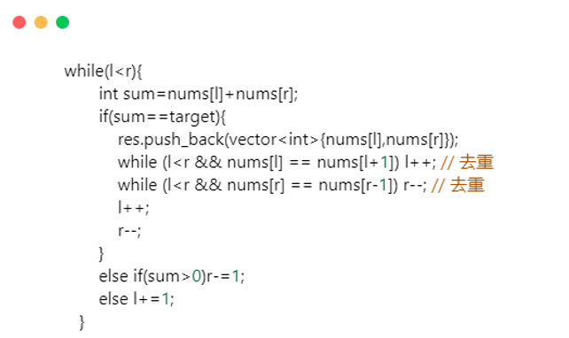

### 2.1.4. 三数之和

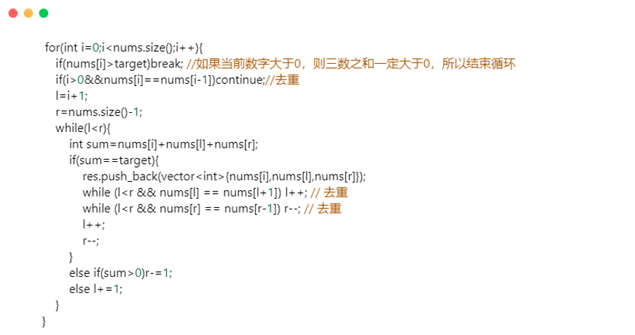

### 2.1.5. 结论
1. 去重，如果相邻的数相同，需要跳过
2. 如果最小的数已经比target大 那么就没有答案

## 2.2. 第二题:删除重复数字
1. 给定一个包含 n + 1 个整数的数组 nums，其数字都在 1 到 n 之间（包括 1 和 n)，可知至少存在一个重复的整数。 
2. 你需要原地删除重复出现的元素，使得每个元素只出现一次不要使用额外的数组空间，必须修改原输入数组并在使用O(1)额外空间的条件下完成。

### 2.2.1. 判断重复数字的一般思路
1. 排序
2. Hash结构 使用额外空间
3. 类似抽屉原理:二分

### 2.2.2. 重复后修改


### 2.2.3. 抽屉原因:针对只有一个重复数字
```
1 3 4 2 2 6 7 5的数组 n=7
先取中位数 (mid=(left+right)/2) 
遍历数组查找小于等于4的数字个数
按照抽屉原理来说 
如果该数量大于中位数4 则重复数在左 right=mid
相反 则在右侧 left=mid+1
```

## 2.3. 第三题:字符串压缩
1. 给定一个字符串，按照重复进行压缩，如果比原来长不压缩

### 2.3.1. 代码实现
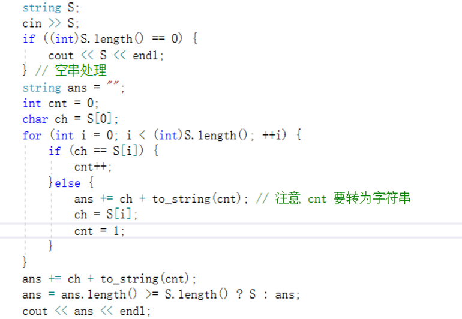

## 2.4. 第四题:矩阵旋转
1. 将矩阵进行旋转
2. 思路就是，将矩阵旋转90度，其他情况都可以认为是90度的变形。

### 2.4.1. 暴力法
1. 构造一个新的矩阵，然后将旋转后对应位置的数据放在当前位置，比如示例中的7应该放在1的位置。matrix_new[col][n-row-1] = matrix[i][j]

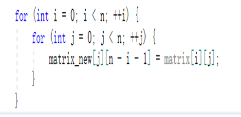


### 2.4.2. 原地旋转
1. 原地旋转：根据上述规律对空间复杂度进行优化
2. 考虑一个元素的联动性，比如上述示例中的1,3,7,9为一个联动，所以在一次循环中，我们做的事情就是将联动的值进行旋转。这样只需要O(1)的空间复杂度

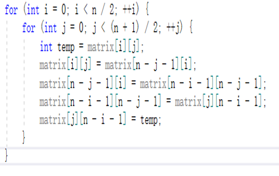

## 2.5. 第五题:柱状图的最大矩形面积
1. 给定 n 个非负整数表示每个宽度为 1 的柱子的高度图，计算按此排列的柱子中矩形的最大面积。

### 2.5.1. 题目思路
1. 对每根柱子，都找到高为柱子高度的面积最大的长方形
2. 比较所有长方形的大小，找出最大的长方形
3. 怎么找到高为柱子高度的最大的长方形？
4. 找到柱子左右两边第一个高度比柱子低的柱子，这两根柱子之间的宽度就是面积最大的长方形的宽

### 2.5.2. 暴力法解决
1. 对于每一根柱子，都分别向左向右遍历，找到第一根小于当前柱子高度的柱子，记录其序号。
2. 当前最大面积:S=(right-left+1)*height

```c++
for (int i = 0; i < lenth; i++) {
	int left = 0;
	int right = 0;
	if (i == 0) {
        left = 0;
    }else {
		for (int t = i; t > 0; t--) {
			if (nums[t] < nums[i]) {left = t + 1;break;}
        }
    }
    if (i == lenth - 1) {
        right = lenth - 1;
    }else {
        for (int t = i; t <lenth; t++) {
            if (nums[t] < nums[i]) {right=t-1;break;}
        }
    }
    int sum = (right - left + 1)*nums[i];
    if (maxsum < sum) {maxsum = sum;}
}
```

### 2.5.3. 递增栈
```
遍历所有的柱子，index记录的是索引
如果：
1.栈空 
2.栈顶索引的柱子高度相遇当前索引的柱子高度
则当前索引入栈
否则一直弹出栈顶的元素直到满足上述两个条件
然后，当前索引入栈
每次弹出栈顶元素的时，计算出以弹出元素为高的最大长方形
如果弹出元素后，栈不为空，其右边界就是当前索引，左边界是栈顶元素索引
即lenth=i-index.top()-1
如果栈为空，就说明右边界是当前索引，左边界是1
```
```c++
int largestRectangleArea(vector<int>& heights) {
	int n = heights.size();
	stack<int> index;
	int area = 0;
	for (int i = 0; i < heights.size(); i++) {
	    if (index.empty() || heights[index.top()] < heights[i]) {index.push(i);}
    }else {
        while (!index.empty() && heights[index.top()] >= heights[i]) {
            int tmp = index.top();
            index.pop();
            int lenth = 0;
            if (index.empty()) lenth = i;
            else lenth = i - index.top() - 1;
            area = max(area, lenth*heights[tmp]);
        }
        index.push(i);
    }
}
```

## 2.6. 第六第七题
1. 简单省略

## 2.7. 第八题:统计单词的覆盖次数

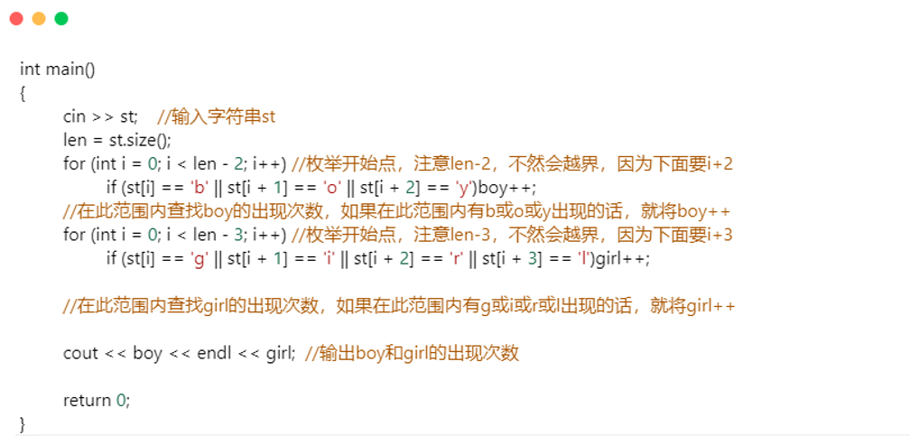
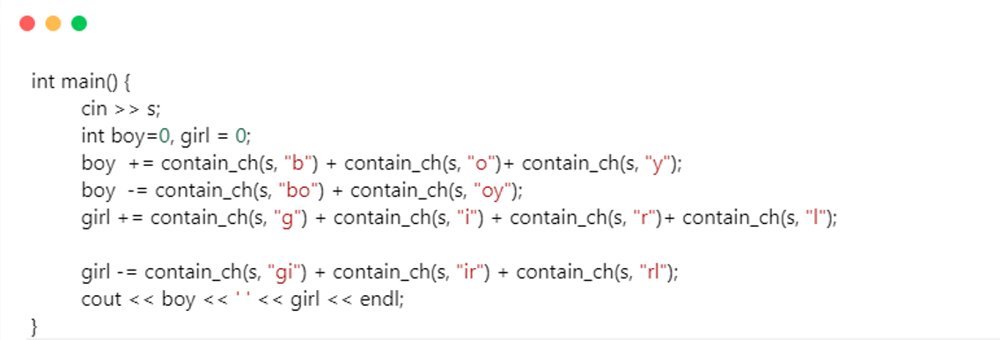

## 2.8. 第九题:最长连续子序列
1. 给定无序数组nums，求nums的最长连续序列的长度。

### 2.8.1. 暴力法
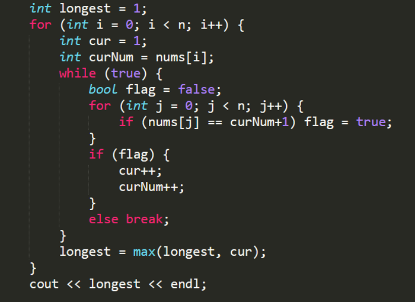

### 2.8.2. 排序、遍历计数
1. 对所有数字进行排序（无需剔除重复数)
从最小的开始遍历，和前一个数连续（即等于前一个数加1)则计数加1，不连续则判断是否是最长连续，并重新开始计数

## 2.9. 第十题:有效的数独
1. 检查数独的有效性

### 2.9.1. 暴力法
1. 分别在每行、每列、每个block内对于每个数字判断有无重复出现
2. 用count记录数字出现次数，大于1返回false
3. 三重循环，时间复杂度O(n^3)，空间复杂度O(1)

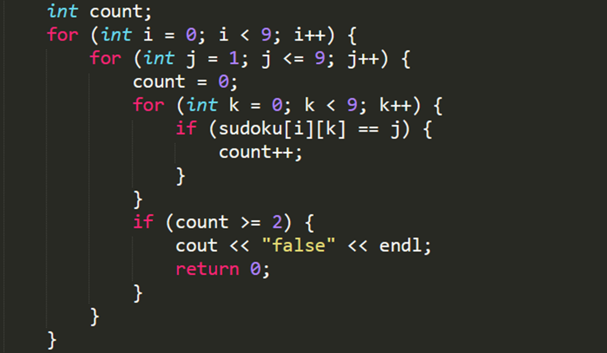
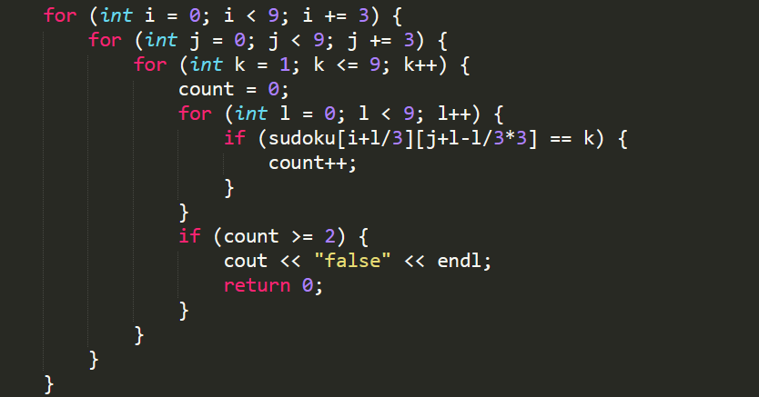

### 2.9.2. 用数组记录(hash表)
1. 对于每行、每列、每个block用一个数组记录每个数字是否出现
2. 出现过的数字在数组内记为1，再出现就返回false,二重循环，时间复杂度O(n^2)，空间复杂度O(n)


# 3. 第三次作业

## 3.1. 第一题:重排链表
1. 给定 n个数字（n未知)组成一个链表，然后给定一个 x 作为基准（x 不一定在链表中)。你需要对链表进行分隔，使得所有小于 x 的节点都在大于或等于 x 的节点之前。
2. 你应当保留两个分区中每个节点的初始相对位置。

### 3.1.1. 实现结构
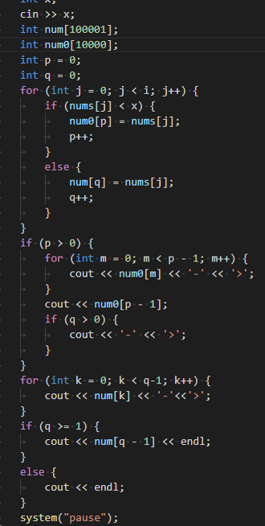
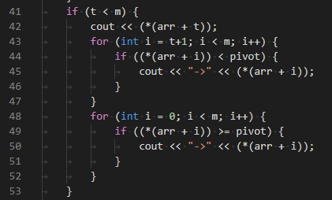

## 3.2. 第二题:加密计算接口
1. 现在我们需要对外提供一个加密接口以满足定制系统的特殊计算任务。该接口为 int encrypt(func,int,int) ，其中 func 是外部调用函数，传入encrypt的一个函数指针typedef int(*func)(int, int)该接口的作用对外部提供的计算进行参数的调整加密（实际上外部调用者并不知道内部加密实现)，并返回各种计算指令的结果。

### 3.2.1. 具体实现
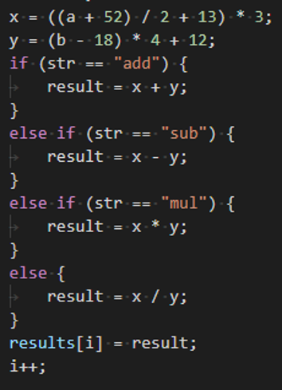

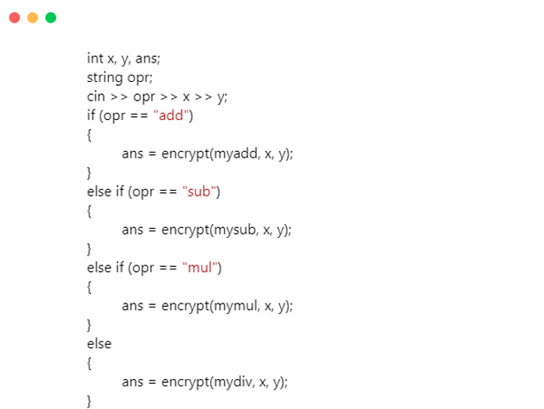

## 3.3. 第三题:合并k个链表
1. 给定k个升序链表，使用链表的结构将其合并
2. 每行输入对应一个排过序的链表数据，输出合并后的升序序列

### 3.3.1. 基本思路
1. 思路一：第一次把两个链表合并为ans,接下去把ans和剩余链表中的一个合并，最后ans就是答案
2. 思路二：同时合并所有链表，比较所有链表当前位置中的所有节点大小，选取一个放入ans，直到所有链表中的节点都被选用了
3. 读取链表：一次getline之后去分割 或者 用cin一个一个读取

### 3.3.2. 两两合并
1. 第一种合并:
```
这个合并已经把两个链表拆散了
要记得判断一个链表为空的情况
合并的时候比较两个链表当前节点的大小，选择小的节点加入结果
最后可能有一个链表还有剩余的元素，要记得加入其中
```
```c++
//拆开两个链表
ListNode* mergeTwoLists(ListNode *a, ListNode *b) {
    if ((!a) && b) {return b;}
    if ((!b) && a) {return a;}
    ListNode head, *tail = &head, *aPtr = a, *bPtr = b;
    while (aPtr && bPtr) {
        if (aPtr->val < bPtr->val) {
            tail->next = aPtr; aPtr = aPtr->next;
        } else {
            tail->next = bPtr; bPtr = bPtr->next;
        }
        tail = tail->next;
    }
    if((!aPtr)&&bPtr){tail->next=bPtr;}
    if((!bPtr)&&aPtr){tail->next=aPtr;}
    return head.next;
}
```

2. 用分治的思想合并所有的链表
```c++
ListNode* merge(vector <ListNode*> &lists, int l, int r) {
    if (l == r) return lists[l];
    if (l > r) return nullptr;
    int mid = (l + r)/2;
    return mergeTwoLists(merge(lists, l, mid), merge(lists, mid + 1, r));
}
ListNode* mergeKLists(vector<ListNode*>& lists) {
    return merge(lists, 0, lists.size() - 1);
};
```

### 3.3.3. 同时合并(最小堆)
1. 先把所有链表的第一个元素放入最小堆
2. 每次弹出最小堆堆顶的元素
3. 再把堆顶元素的下一个元素放入最小堆
4. 直到堆中没有元素

```c++
//自定义优先队列比较的函数
#include <queue>
priority_queue<Type, Container, Functional>
//Type数据类型，Container容器类型，Functional比较函数
struct cmp{     
    bool operator()(ListNode *a,ListNode *b){
        return a->val > b->val;
    }
};
```

## 3.4. 第四题:双向链表
```
给定一个序列，实现双向链表数据结构的添加、查找、删除、统计、翻转操作 输入由两部分组成，
原始创建链表数据和依次执行的操作 执行的操作包括addbegin、addend、addmid、search、
delete、count、reverse,每个操作打印对应输出 addbegin val，在序列开头插入val，打印新链表
addend val，在序列末尾插入val，打印新链表
addmid val pos，在序列pos位置插入val，打印新链表，pos从0开始计数，不会有超出链表长度的
pos
search val，查找val的位置，打印位置pos，如果有链表中有多个相同值，打印第一个值，如链表为
111，search 1，则输出0
delete pos，删除pos位置的节点，打印新链表，不会有超出链表长度的pos
count，打印链表元素个数
reverse，翻转整个链表
```

### 3.4.1. 具体实现
```c++
struct Node{
    int val;
    struct Node* next;
    struct Node* prev;
    Node(int x) : val(x), next(NULL), prev(NULL) {};
};
void print(Node* head) {
	Node* p = head->next;
	while (p->next != NULL) {
		cout << p->val << " ";
		p = p->next;
	}
	cout << p->val << endl;
}
```
1. 详细见PPT

## 3.5. 第五题:矩阵乘法

### 3.5.1. 解决方案
1. 输入的处理
   1. 对于所有的输入先按照字符型矩阵来进行输入，因为可能会因为第二个矩阵为非数值型矩阵需要继续转化为字符型矩阵
2. 矩阵乘法处理
   1. 分别对应两个处理办法
   2. 一个处理数值型矩阵的乘法，一个处理字符型矩阵的乘法（或者是构造元素之间的乘法和加法)
   3. 值得注意的是按照数值型处理的过程结束之后，整型的数据要转化为整型
3. 输出处理
   1. 对于输出的处理就直接按照字符型矩阵进行处理即可

### 3.5.2. 详见文件

# 4. 第四次作业
1. 面向对象编程

## 4.1. 简单工厂
1. 使用虚函数

## 4.2. 汉堡问题:装饰者模式
1. 具体重载一个类

## 4.3. 擂台赛
1. 纯虚函数定义方法
2. pk()作为友元函数可以访问所有的内部的变量

## 4.4. 第四题:XO题
1. 局部性检查即可

## 4.5. 第五题:汽车调研题
1. 设计一下类的情况

## 4.6. 停车场问题
1. 可以想象成一个内存分配的问题

## 4.7. 银行账户模拟
1. 开闭原则和设计

## 4.8. 商品每日销售额
1. 折扣需要注意

## 4.9. MyString类

## 4.10. TomAndJerry
1. 简单的设计一下即可

# 5. 第一次考试
1. long long ll :运行中越界
2. 反复进行套娃操作